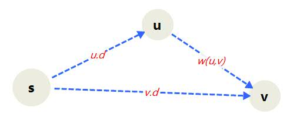
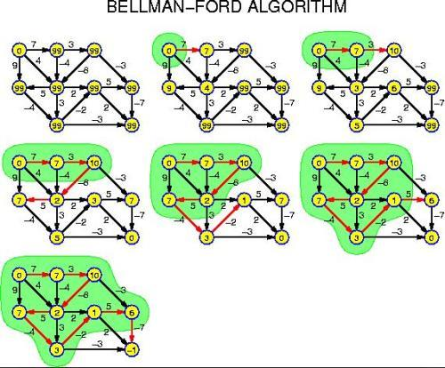
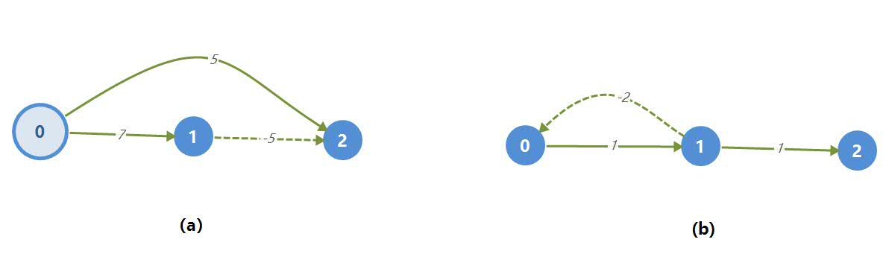

[TOC]

## 写在前面

仅作为个人学习资料，文章内容来源于《算法导论》，及网上找到的参考资料，侵删。

# 单源最短路径问题

给定一个图$G=(V,E)$，我们希望找到从给定源节点$s \in V$到每个结点$v \in V$的最短路径。

## **单源最短路径**

在**最短路径问题**中，我们给顶一个带权重的有向图$G=(V,E)$和权重系数$w:E\to R$，该权重系数的每条边映射到实数值得权重上。图中一条路径$p=<v_0,v_1,\cdots,v_k>$的**权重**$w(p)$是构成该路径的所有边的权重之和：
$$
w(p)=\sum_{i=1}^k{w(v_{i-1},v_i)}
$$
定义从结点$u$到结点$v$的**最短路径权重**$\delta(u,v)$如下：
$$
\delta(u,v)= \begin{cases}
min \{ w(p):u \leadsto v \} & 如果存在一条从结点u到结点v的路径\\
\infty & 其他
\end{cases}
$$
从结点$u$到结点$v$的**最短路径**定义为任何一条权重为$w(p)=\delta(u,v)$的从$u$到$v$的路径

### **变体问题**

单目的地最短路径问题： 找到从每个结点$v$到给定**目的地**结点$t$的最短路径。如果将图的每条边的方向翻转过来，就可以将这个问题转变为单源最短路径问题

单结点最短路径问题

最短路径的最优子结构

#### *最短路径的子路径也是最短路径

给定带权重的有向图$G=(V,E)$和权重系数$w:E \to R$。设$p=<v_0,v_1,\cdots,v_k>$为 从结点$v_0$到结点$v_k$的一条最短路径，并且对于任意的$i$和$j$，$0\leq i \leq j \leq k$，设$p_{ij}=<v_i,v_{i+1},\cdots,v_j>$为路径$p$中从结点$v_i$到结点$v_j$的子路径。那么$p_{ij}$是从结点$v_i$到结点$v_j$的一条最短路径。

### 负权重的边

某些单源最短路径的问题可能包含权重为负值的边。

如果图$G=<V,E>$不包含从源节点$s$可以到达的权重为负值的环路，则对于所有结点$v \in V$，最短路径权重$\delta(s,v)$都有精确定义，即使其取值是负数。

如果图$G$包含从$s$可以到达的权重为负值的环路，则最短路径权重无定义。

### 环路

最短路径也不能包含权重为正值的环路。

如果从源结点$s$到终结点$v$存在一条包含权重为0的环路的最短路径，则也同时存在另一条不包含该环路的从结点$s$到结点$v$的最短路径。只要一条最短路径上还有权重为0的环路，我们可以重复删除这些环路，直到一条不包含环路的最短路径。

因此，不失一般性，我们可以假设它们都是最短路径。由于图$G=(V,E)$中的任意无环路最多包含$|V|$个不同的结点，它也最多包含$|V|-1$条边。

### 最短路径的表示

在通常情况下，我们不但希望计算出最短路径权重，还希望计算出最短路径上的结点。给定图$G=(V,E)$，对于每个结点$v$，我们维持一个前驱结点 $v.\pi$，该前驱结点可能是另一个结点或者NIL。最短路径的算法将对每个结点的 $\pi$ 属性进行设置，这样，将从结点$v$开始的前驱结点链翻转过来，就是从 $s$ 到 $v$ 的一条最短路径。

### 最短路径树

假定$G$不包含从$s$可以到达的权重为负值的环路，因此，所有的最短路径都有定义。

一棵根结点为$s$的最短路径树是一个有向子图$G'=(V',E')$，这里$V' \subseteq V,E' \subseteq E$，满足：

1. $V'$是图$G$中从源结点$s$可以到达的所有结点的集合。
2. $G'$形成一棵根结点为$s$的树。
3. 对于所有结点$v \in V' $，图$G'$从结点$s$到结点$v$的唯一简单路径是图$G$中从结点$s$到结点$v$的一条最短路径。

需要指出，最短路径不一定是唯一的，最短路径树也不一定是唯一的。

### 松弛操作

对于每一个结点$v$来说，我们维持一个属性$v.d$用来记录从源结点$s$到$v$的最短路径权重的上界。我们称$v.d$为$s$到$v$的**最短路径估计**。

**初始化算法**运行时间为$\Theta(V)$

INITIALIZE-SINGLE-SOURCE(G,s)

1. for each vertex  $v \in G.V$
   2. $v.d =\infty$     

​          3. $v.\pi = NIL$   

4.  $s.d = 0$

在初始化操作结束后，对于所有结点$v \in V$，我们有$v.\pi =NIL，\ s.d=0$，对于所有的结点$v \in V -\{ s\}$，我们有$v.d=\infty$



对一条边$(u,v)$的**松弛**过程为：首先测试一下是否可以对从$s$到$v$的最短路径进行改善。测试的方法是，将从结点$s$到结点$u$之间的最短路径距离加上结点$u$到$v$的边权重，并与当前$s$到$v$的最短路径估计进行比较，如果前者更小，则对$v.d \ ,\ v. \pi$进行更新。松弛步骤可以降低最短路径的估计值$v.d$并更新$v$的前驱属性$v.\pi$。

**对边$(u,v)$在$O(1)$时间内进行的松弛操作**：

RELAX$(u,v,w)$

1. if $v.d > u.d+w(u,v)$
   2. $v.d=u.d+w(u,v)$
   3. $v.\pi=u$

松弛是唯一导致最短路径估计和前驱结点发生变化的操作。本章讨论的算法都将调用算法INITIALIZE-SINGLE-SOURCE，然后重复对边进行松弛操作。算法之间的不同之处是对每条边进行松弛的次数和松弛边的顺序不同。Dijkstra算法和应用于有向无环图的最短路径算法对每条边仅松弛一次，Bellman-Ford算法则对每条边松弛$|V|-1$次。

### 最短路径的松弛算操作的性质

后面的五条都涉及最短路径估计或前驱子图，它们成立的前提是必须调用INITIALIZE-SINGLE-SOURCE(G,s)来实现对图的初始化，并且对最短路径的估计和前驱子图进行的改变都是通过一系列的松弛步骤实现的。

#### *三角不等式性质

设$G=(V,E)$是一个带权重的有向图，其权重函数由 $w:E \to R$ 给出，其源结点为$s$。

那么对于所有的边$(u,v)\in E$ ，我们有$\delta(s,v) \leq \delta(s,u)+w(u,v)$

#### *上界性质

设$G=(V,E)$是一个带权重的有向图，其权重函数由 $w:E \to R$ 给出，其源结点为$s$，该图由算法INITIALIZE-SINGLE-SOURCE(G,s)执行初始化。

那么对于所有的结点$v \in V,v.d\geq \delta(s,v)$，并且该不变式在对图$G$的边进行任何次序的松弛过程保持成立。

而且，一旦$v.d$取得其下界$\delta(s,v)$后，将不再发生变化。

**证明：归纳法**

#### *非路径性质

设$G=(V,E)$是一个带权重的有向图，其权重函数由 $w:E \to R$ 给出，其源结点为$s$，该图由算法INITIALIZE-SINGLE-SOURCE(G,s)执行初始化。

假定从源结点$s$到给定结点$v \in V$之间不存在路径，

我们有$v.d=\delta(s,v)= \infty$，并且该等式作为不变式一直维持到图$G$的所有松弛操作结束。

#### *收敛性质

设$G=(V,E)$是一个带权重的有向图，其权重函数由 $w:E \to R$ 给出，该图由算法INITIALIZE-SINGLE-SOURCE(G,s)执行初始化，并在这之后进行了一系列边的松弛操作。

设其某个源结点为$s \in V $，$s \leadsto u \to v$ 为图$G$中的一条最短路径，这里$u,v \in V$。

如果在对边$(u,v)$进行松弛操作之前的任意时刻都有$u.d=\delta(s,u)$，

则在松弛操作之后的所有时刻有$v.d=\delta(s,v)$。

#### *路径松弛性质

设$G=(V,E)$是一个带权重的有向图，其权重函数由 $w:E \to R$ 给出。

设其某个源结点为$s \in V $，考虑从源结点$s$到结点$v_k$的任意一条最短路径$p=<v_0,v_1,\cdots,v_k>$。

该图由算法INITIALIZE-SINGLE-SOURCE(G,s)执行初始化，并在这之后进行了一系列边的松弛操作。其中包括对边$(v_0,v_1),(v_1,v_2),\cdots,(v_{k-1},v_k)$按照所列次序而进行的一系列的边松弛操作，

则在所有这些松弛操作之后，我们有$v_k.d=\delta(s,v_k)$，并且在此之后该等式一直保持成立。

该性质的成立与其他边的松弛操作及次序无关。

#### *前驱子图性质

设$G=(V,E)$是一个带权重的有向图，其权重函数由 $w:E \to R$ 给出，

设其某个源结点为$s \in V $，假定图$G$不包含从源结点$s$可以到达的权重为负值的环路。

假设该图由算法INITIALIZE-SINGLE-SOURCE(G,s)执行初始化，并在这之后对图$G$进行了任意次序的松弛操作。该松弛操作针对所有的结点$v \in V$生成$v.d=\delta(s,v)$，则前驱子图$G_k$形成一根根结点为$s$的最短路径树。

## Bellman- ford算法

Bellman- ford算法,,采用动态规划（Dynamic Programming）进行设计。Bellman-ford与Dijkstra有相似的地方，都是通过松弛操作来达到最短路径。不同的是，Dijkstra是通过从近到远的顺序来按**点**的顺序松弛，Bellman-ford则是按输入时对每一条**边**的顺序来松弛

Bellman_Ford算法解决的是一般情况下的单源最短路径问题，边的权重可以为负值。

Bellman-Ford算法返回一个布尔值，以表明是否存在一个从源结点可以到达的权重为负值的环路。如果存在这样一个环路，算法将告诉我们不存在解决方案。如果没有这种环路存在，算法将给出最短路径和他们的权重。

### 算法思想

第1轮在对所有的边进行松弛后，得到的是源点最多经过一条边到达其他顶点的最短距离；第2轮在对所有的边进行松弛后，得到的是源点最多经过两条边到达其他顶点的最短距离；第3轮在对所有的边进行松弛后，得到的是源点最多经过三条边到达其他顶点的最短距离......

### 算法图示



图来自知乎

### 算法步骤

Bellman-Ford 算法通过对边进行松弛操作来逐渐降低从源结点$s$到每个结点$v$的最短路径的估计值$v.d$ ，直到该估计值与实际的最短路径权重$\delta(s,v)$相同为止。

该算法返回TRUE值当且仅当输入图不包括可以从源结点到达的权重为负值的环路

```
Bellman_Ford(G,w,s)
  1. INITALIZE_SINGLE_SOUCRE(G,s)    //初始化
  2. for i=1 to |G.V|-1              //对每条边进行 |V|-1 次处理
  3. 	for each edge(u,v) in G.E    //对图的每一条边进行松弛操作
  4.        RELAX(u,v,w)      
  5. for each edge(u,v) in G.E      //检查图中是否有权重为负值的环路，并返回与之对应的Boolean值
  6.    if v.d > u.d + w(u,v)
  7.        return FALSE
  8. return TRUE
```

### 代码实现

由于图的具体实现，学过的有邻接链表和邻接矩阵，没法直接由边的编号直接得到边的起点和终点及权重。

对于算法第3步遍历边进行松弛操作，需要从边的编号得到起点，终点和权重。可能实现要依赖图的具体数据结构。

```c++
const int maxValue = 9999;//正无穷，当边上的权重为正无穷时表示两个顶点之间没有边
template<class T, class E>
void Bellman_Ford(Graphmtx<T, E>& G, int v, E dist[], int path[]) {
	//Bellman-Ford求最短路径,在带权有向图中有的边具有负的权值
	//Graphmtx是带权有向图的封装类，在这里是由邻接矩阵实现的
	//v为起始顶点，从v开始找到所有其他顶点的路径
	//数组dist[j],0<j<n,是当前求得从顶点v到顶点j的最短路径长度，即最短路径估计 v.d
	//数组path[j],0<j<n，存放求到的最短路径，v.pi
	int  i, k, u,；
    int n = G.NumberOfVertices(); //n为图中结点个数
    int e = G.NumberOfEdges();//e为图中边的个数
    E w;
	for (i = 0; i < n; i++) { //数组初始化
		dist[i] = G.getWeight(v, i);//图的基本操作，获得v到i边上的权重
		if (i != v && dist[i] < maxValue) //当从v到i的直接边存在时，保存结点
            path[i] = v;
		else path[i] = -1;//当v到i不存在直接路径时，设为-1
	}
	for (k = 2; k < n; k++) //n-1次处理
		for (u = 0; u < n; u++)
			if (u != v)
				for (i = 0; i < n; i++) {//由于图的实现问题，通过结点来遍历每一条边，
					w = G.getWeight(i, u);
					if (w > 0 && w<maxValue && dist[u]>dist[i] + w) {
						dist[u] = dist[i] + w;
						path[u] = i;
					}
				}
    boolean flag=true;
    for (int j = 0; j < n; j++) {
                for (int k = 0; k < n; k++) {
                        if (dist[k] > dist[j] + G.getWeight(j, k)) {
                                flag = false;
                        }
                }
        }
};
```

### 复杂度分析

算法第1行的初始化操作需要时间为$O(V)$，

第2到4行循环的运行时间为$O(E)$，且一共进行$|V|-1$次循环

第5到7行的for循环所需时间为$O(E )$

Bellman-Ford算法的总运行时间为$O(VE)$

### 算法证明

假设图$G$不包含从源点$s$到达的权重为负的值的环路。

我们首先证明，对于所有结点$v \in V$，在算法Bellman_Ford算法中


## DAG-SHORTEST-PATHS

### 算法思想

算法先对有向无环图进行拓扑排序，以确定结点之间的一个线性次序。只需按着拓扑排序的次序对结点进行一遍处理即可。每次对一个结点处理，我们可以对从该结点发出的所有的边进行松弛操作。

### 算法步骤

```
DAG-SHORTEST-PATHS(G,w,s)
1. topologically sort the vertices of G
2. INITIALIZE-SINGLE-SOURCE(G,s)
3. for each vertex u ,taken in topologically sorted order
4.     for each vertex v in G.adj[u]
5.         RELAX(u,v,w)
```

### 算法分析

 算法第1行拓扑排序时间为$O(V+E)$

第2行对INITIALIZE-SINGLE-SOURCE的调用时间为$O(V)$

第3到5行 外循环对于每一个结点执行一遍 ，第4到5行内循环对每条边刚好松弛一次，内循环运行时间为$O(1)$

算法总的运行时间为$O(V+E)$。对于邻接链表表示的图来说，时间为线性级。

## Dijkstra算法(Dijkstra's Shortest Paths)

Dijkstra(迪杰斯特拉)算法是典型的单源最短路径算法，用于计算一个节点到其他所有节点的最短路径。主要特点是以起始点为中心，基于贪心策略，向外层层扩展，直到扩展到终点为止。

#### 算法思想

设$G=(V,E)$是一个带权有向图，把图中顶点集合$V$分成两组，

- 第一组为已求出最短路径的顶点集合（用$S$表示，初始时$S$中只有一个源点，以后每求得一条最短路径 , 就将加入到集合$S$中，直到全部顶点都加入到$S$中，算法就结束了），
- 第二组为其余未确定最短路径的顶点集合（用$U$表示），

按最短路径长度的递增次序依次把第二组的顶点加入S中。在加入的过程中，总保持:

- 从源点$v$到$S$中各顶点的最短路径长度不大于从源点$v$到$U$中任何顶点的最短路径长度。

- 此外，每个顶点对应一个距离，$S$中的顶点的距离就是从$v$到此顶点的最短路径长度。$U$中的顶点的距离，是从$v$到此顶点只包括$S$中的顶点为中间顶点的当前最短路径长度

在一般情况下（没有负边），下一条长度次短的最短路径的长度必然是
$$
D[j] = Min \{  D[i] \ | \ v_i \in V -S \}
$$
其中，$D[i]$或者是弧$(v,v_i)$上的权值，或者是$D[k](v_k \in S)$和弧$(v_k,v_i)$上的权值之和。

#### 算法步骤

 假设用带权值的邻接矩阵$arcs$来表示带权有向图，$arcs[i][j]$表示弧$<v_i,v_j>$上的权值。若$<v_i,v_j>$ 不存在，则置$arcs[i][j]$为$\infty$。

1. $S$ 为已找到从 $v$ 出发的最短路径的终点的集合，它的初始状态为空集。那么，从 $v$ 出发到图上其余各顶点 $v_i$ 可能到达的最短路径长度的初值为：
   $$
   D[i]=arcs[Locate Vex(G,v)][i]    v_i\in V
   $$
   
2. 选择 $v_j$使得
   $$
   D[j] = Min \{  D[i] \ | \ v_i \in V -S \}
   $$
   $v_j$就是当前求得的一条从$v$出发的最短路径的终点。令
   $$
   S\ =\ S \ \cup \{ j\} 
   $$

3. 修改从$v$出发到集合 $V - S$ 上任一顶点 $v_k$ 可达到的最短路径长度。如果
   $$
   D[j]+arcs[j][k] < D[k]
   $$
   则修改 $D[k]$ 为
   $$
   D[k]=D[j]+arcs[j][k]
   $$

4. 重复操作2,3共n-1次。由此求得从$v$到图上其余各顶点的最短路径。

#### 算法演示


#### 代码实现

```c++
template<class T, class E>
void ShortestPath(Graphlnk<T, E>& G, T v, E dist[], int path[]) {
	//Dijkstra求最短路径
	//Graphmtx是带权有向图(邻接矩阵实现)，
	//v为起始顶点，从v开始找到所有其他顶点的路径
	//数组dist[j],0<j<n,是当前求得从顶点v到顶点j的最短路径长度
	//数组path[j],0<j<n，存放求到的最短路径
	int n = G.NumberOfVertices();
	v = G.getVertexPos(v);
	bool* S = new bool[n];//
	int i, j, k; E w, min;
	for (i = 0; i < n; i++) {
		dist[i] = G.getWeight(v, i); //数组初始化
		S[i] = false;
		if (i != v && dist[i] < maxValue) path[i] = v;
		else path[i] = -1;
	}
	S[v] = true; dist[v] = 0;//顶点v加入顶点集合
	for (i = 0; i < n - 1; i++) {
		min = maxValue; int u = v;//选不在S中具有最短路径的顶点u
		for (j = 0; j < n; j++)
			if (S[j] == false && dist[j] < min)
			{
				u = j;
				min = dist[j];
			}
		S[u] = true;//将顶点u加入集合S
		for (k = 0; k < n; k++) { //修改
			w = G.getWeight(u, k);
			if (S[k] == false && w < maxValue && dist[u] + w < dist[k]) { //松弛操作
				//顶点k未加入S，且绕过u可以缩短路径
				dist[k] = dist[u] + w;
				path[k] = u; //修改到k的最短路径
			}
		}
	}
};
```

#### 算法分析

Dijkstra 算法利用的贪心策略来求解最短路径。

算法的主要部分是一个双重循环，外层循环内有两个并列的单层循环，任取一个循环内的操作为基本操作时，基本操作执行的总次数为双层循环执行的次数。时间复杂度为$O(|V|^2)$。

如果使用堆优化可以将复杂度优化到$O(|V+E|\ \ log|E|)$，使用斐波那契堆来实现最小队列可以改善到$VlogV+E$。

但是Dijkstra 算法只适用于不带负权边的图。若允许边上有负权值，则在与$S$（已求得最短路径的顶点集，归入$S$内的结点的最短路径不再变更）内某点（记为a）以负边相连的点（记为$b$）确定其最短路径时，其最短路径长度加上这条负边的权值结果可能小于$a$原来确定的最短路径长度，而此时$a$在Dijkstra算法下无法更新。



例如，对于上图所示的带权有向图，利用Dijkstra 算法不一定能得到正确结果。

### 算法优化

使用一个最小队列Q来保存结点集合。

## 差分约束和最短路径

### 差分约束系统

### 求解差分约束系统

