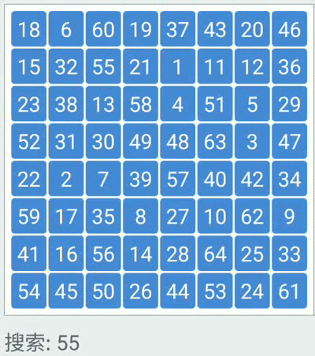

# 三 求解递归式及分治策略

# 一 递归式的求解

- **代入法** 	我们猜测一个界，然后使用数学归纳法证明这个界是正确的

- **递归树法**   将递归式转换为一棵树，其结点代表不同层次的递归调用产生的代价。然后采用边界和技术来求解递归式

- **主方法**      求解形如下面公式的递归式的界：
  $$
  T(n) = aT(n/b)+f(n)  \\
  a \geq 1, b>1
  $$
  

## 1.1 代入法

### **代入法**

**代入法**求解递归式分为两步：

1. 猜测解的形式
2. 用数学归纳法求出解中的常数，并证明解释正确的

难点在于正确的猜测出解的形式

### 好的猜测的方法

1. 根据经验
2. 先证明递归式较松的上界和下界，然后缩小

### 常用的技巧与需要注意的地方

1. 有时你可能正确猜出了递归式解的渐进界，但是在归纳证明时失败了，问题常常出在归纳假设不够强。当遇到这种情形时，可以修改猜测，将它减去一个低阶的项。
2. 在使用渐进符号是要严谨
3. 使用变量代换进行转换

### 例题与习题

### **例题1**  

$$
确定T(n)=4T(n/2)+n 的上界   \ （T(1)=\Theta(1)）
$$
我们猜测其解为$O(n^2)$

 首先证明 $T=O(n^3)$	
$$
\begin{array} 
&n=1	\ 				\\
	&T(1)=O(1)	\leq c \ (if \ c \ is \ large)				\\
Assume \ k<n	\ 		\\
	&T(k)\leq ck^3 = O(k^3)									\\					
Then  \ n				\\
 	&T(n)  =4T(n/2)+n \\
 	&\  \ \ \ \ \ \ \ \ \  	\leq 4c(n/2)^3+n	\\
 	&\  \ \ \ \ \ \ \ \ \  	= 1/2cn^3+n	\\
 	&\  \ \ \ \ \ \ \ \ \  	= cn^3-(1/2cn^3-n)	\\
 	&\  \ \ \ \ \ \ \ \ \  	\leq cn^3(if\ 1/2cn^3-n\geq 0  )	\\
 	&\  \ \ \ \ \ \ \ \ \  	=O(n^3)	\\
\end{array}	\\
其中 \  1/2cn^3-n\geq 0  \\
\Rightarrow n\geq1,c\geq2
$$
再证明$T=O(n^2)$
$$
\begin{array} 
&n=1	\ 				\\
	&T(1)=O(1)	\leq c \ (if \ c \ is \ large)				\\
Assume \ k<n	\ 		\\
	&T(k)\leq ck^2 = O(k^2)									\\					
Then  \ n				\\
 	&T(n)  =4T(n/2)+n \\
 	&\  \ \ \ \ \ \ \ \ \  	\leq 4c(n/2)^2+n	\\
 	&\  \ \ \ \ \ \ \ \ \  	= cn^2+n	\\
 	&\  \ \ \ \ \ \ \ \ \  	= cn^2-(n)	\\
 	&\  \ \ \ \ \ \ \ \ \  	\nleq cn^2 =O(n)\\
 	
\end{array}	\\
$$
观察发现多了一个$n$项，所以我们需要想方法去凑一下，消掉n

不妨假设$T(k)=c_1 k^2-c_2 k)$
$$
\begin{array} 
&n=1	\ 				\\
	&T(1)=c_1-c_2	\leq c \ (if \ c_1 is\  close \ to \ c_2 \ and c_1>c_2)				\\
Assume \ k<n	\ 		\\
	&T(k)\leq c_1k^2-c_2k = O(k^2)									\\					
Then  \ n				\\
 	&T(n)  =4T(n/2)+n \\
 	&\  \ \ \ \ \ \ \ \ \  	\leq 4[c_1(n/2)^2-c_2(n/2)]+n	\\
 	&\  \ \ \ \ \ \ \ \ \  	= c_1n^2+(1-2c_2)n	\\
 	&\  \ \ \ \ \ \ \ \ \  	\leq c_1n^2-c_2n	(for\  c_2 \geq1)\\
 	&\  \ \ \ \ \ \ \ \ \  	\leq c_1n^2 =O(n^2)\\
\end{array}	\\
其中c_2\geq1,c_1\geq c_2 and c_1 is close\ to \ c_2
$$
### **例题2**

$$
确定T(n)=2T(\lfloor n/2\rfloor)+n的上界
$$
我们猜测其解为$T(n)=O(nlgn)$。 代入法要求证明恰当选择常数$c>0$，可有$T(n)\leq cnlgn$

假定此上界对所有正数$m<n$都成立，特别是对于$m=\lfloor n/2 \rfloor$，有$T(\lfloor n/2 \rfloor) \leq c\lfloor n/2 \rfloor lg(\lfloor n/2 \rfloor)$

将其带入递归式得到 
$$
\begin{aligned}
T(n) &=2T(\lfloor n/2 \rfloor)+n \\
	 &\leq 2 c\lfloor n/2 \rfloor lg(\lfloor n/2 \rfloor)+n \\
	 &\leq cnlg(\lfloor n/2 \rfloor)+n \\
	 &=cnlgn-cnlg2+n				\\
	 &=cnlgn-cn   \\
	 &\leq cnlgn = O(nlgn) \ if \ c \geq1
\end{aligned}
$$
现在我们来看边界条件

假设$T(1)$是递归式的唯一的边界条件，对$n=1$，边界条件$T(n)\leq cnlgn$推导出$T(1)\leq clg1=0$，与$T(1)=1$矛盾，因此，归纳假设的基本情况不成立。

注意到 **渐进符号仅要求我们对$n\geq n_0$，这个$n_0$我们是可以自己选择的常数。**

我们观察递推式，注意到对于$n>3$，递归式不直接依赖$n=1$。我们可以将$n_0$设为$2$，这样我们将整个式子分为$T(1)=1$的特殊情形和剩下的情况。
$$
T(2)=2T(1)+1=3 \leq c*2lg2=c=O(nlgn) \\

T(3)=2T(1)+3=5 \leq c*3lg3 =O(nlgn)
$$


**练习题4.3-1**
$$
证明：T(n)=T(n-1)+n 的解为 O(n^2)
$$
**练习题4.3-2**
$$
证明：T(n)=T(\lceil n/2 \rceil)+1 的解为 O(lgn)
$$
**练习题4.3-2**

我们知道$T(n)=T(\lfloor n/2 \rfloor)+1 的解为 O(nlgn)$，证明$\Omega(nlgn)$也是这个递归式的解，从而得出结论：解为$\Theta(nlgn)$


## 1.2 递归树法

### 递归树法

**递归树**中，每一个节点表示一个单一子问题的代价，子问题对应某次递归函数的调用。我们将树中每层中的代价求和，得到每层代价，然后将所有层的代价求和，得到所有层次的递归调用的总代价。

递归树最适合用来生成好的猜测，然后即可用代入法来验证猜测是否正确。

当使用递归树来生产好的猜测时，需要忍受一些“不精确”,因为我们只需要估计一个大致的上界即可。

但是如果在画递归树和求和时比较精确，可以使用递归树直接证明解是否正确。

### 例题与习题

### **例题一**

$$
求解T(n)=3T(\lfloor n/4 \rfloor)+cn^2
$$


$$
\begin{aligned}
T(n) &=cn^2+\frac{3}{16}cn^2+(\frac{3}{16})^2cn^2+\cdots+(\frac{3}{16})^{log_4n-1}cn^2 +\Theta(n^{log_43})\\
	 &= \sum_{i=0}^{log_4n-1}(\frac{3}{16})^icn^2+\Theta(n^{log_43}) \\
	 &= \frac{(3/16)^{log_4n}-1}{(3/16)-1}cn^2+ \Theta(n^{log_43})\\
	 &<\sum_{i=0}^{\infty}(\frac{3}{16})^icn^2+\Theta(n^{log_43})				\\
	 &= \frac{1}{1-(3/16)}cn^2+ \Theta(n^{log_43}) \\
	 &= \frac{16}{13}cn^2+\Theta(n^{log_43}) \\
	 &=O(n^2)
\end{aligned}
$$
**代入法证明：** $T(n)=O(n^2)$是递归式$T(n)=3T(\lfloor n/4 \rfloor)+\Theta(n^2)$的一个上界

我们希望证明$T(n)\leq dn^2$对某个常数$d>0$成立。我们使用常数$c>0$，有
$$
\begin{aligned}
T(n) 
	 &\leq 3T(\lfloor n/4 \rfloor)+cn^2				\\
	 &\leq 3d \lfloor n/4 \rfloor^2+cn^2\\
	 &\leq 3d(n/4)^2+cn^2 \\
	 &= \frac{13}{16}dn^2+cn^2 \\
	 &\leq d n^2  \ if\ d\geq(16/13)c
\end{aligned}
$$


### **例题二**

$$
T(n)=T(n/3)+T(2n/3)+O(n)
$$


从根到叶的最长简单路径是 $n \rightarrow (2/3)n \rightarrow (2/3)^2n \rightarrow \cdots \rightarrow 1$.由于当$k=log_{3/2}n$时，$(2/3)^kn=1$，因此树高$log_{3/2}n$。

如果递归树是一棵高度为$log_{3/2}n$的完全二叉树，则叶节点的数量应为$2^{log_{3/2}n}=n^{log_{3/2}2}$，由于每个叶节点的代价是常数，因此所有叶节点的总代价为$\Theta(n^log_{3/2}2)$，由于$log_{3/2}$是大于$1$的常数，因此所有叶结点的总代价为$\Omega(nlgn)$。

但是此递归树并不是完全二叉树，因此叶节点的数量小于$n^{log_{3/2}2}$。而且从根节点往下走时，越来越多的结点是缺失的，递归树中靠下的层次的贡献小于$cn$。由于我们只希望得到一个大致的猜测值，不妨认为其上界为$O(nlgn)$，我们接下来证明。

**证明**           $T(n)\leq dnlgn$，其中$d$是一个恰当的正整数。
$$
\begin{aligned}
T(n) 
	 &\leq T(n/3)+T(2n/3)+cn				\\
	 &\leq d(n/3)lg(n/3) +d(2n/3)lg(2n/3)+cn\\
	 &= (d(n/3)lgn-d(n/3)lg3)+(d(2n/3)lgn-d(2n/3)lg3)+cn \\
	 &= dnlgn-d(\ (n/3)lg3+(2n/3)lg(3/2)    \ ) +cn \\
	 &= dnlgn-d(\ (n/3)lg3+(2n/3)lg3-  (2n/3)lg2  \ ) +cn		\\
	 &= dnlgn -dn(lg3-2/3)+cn \\
	 &\leq dnlgn  \ if\ d\geq c/(lg3-(2/3))
\end{aligned}
$$

### 例题三

$$
确定T(n)=T(n/2)+T(n/4)+n^2的上界
$$


我们发现每一层是在不断递减的，并且观察其系数有$1,5/16,(5/16)^2,\dots$。显然是一个等比数列，我们可以通过等比数列求和公式求出前$n$项和。但是显然递归树并不是完全二叉树，从根节点往下走，越来越多的内结点是缺失的，最终的叶节点的贡献是小于n的，但是我们只是求得一个猜测的上界值，这样的不精确是可以允许的。

我们有
$$
(1+\frac{5}{16}+(\frac{5}{16})^2+\cdots+(\frac{5}{16})^k+\cdots)n^2 
\leq 2n^2
$$
所以$T(n)=O(n^2)$


## 1.3 主方法

主方法为求解如下形式的递归式提供了一种标准求解方法

$T(n)=aT(n/b)+f(n)$，其中$a\geq 1,b \geq 1 且是常数，f(n)是渐进正函数$

### **主定理**

$令a\geq 1 和 b>1 是常数，f(n)是一个函数,T(n)是定义在非负整数上的递归式：$

​			$T(n)=aT(n/b)+f(n)$

$其中我们将n/b解释为 \lceil n/b \rceil或\lfloor n/b \rfloor。那么T(n)有如下渐进界:$

​		$1. 若对某个常数\varepsilon >0 ,有f(n)=O(n^{log_ba-\varepsilon})，则T(n)=\Theta(n^{log_ba}）$ 

​		$2.若f(n)=\Theta(n^{log_ba})，则T(n)=\Theta(n^{log_ba}lg n)$

​		$3.若对某个常数\varepsilon >0有 f(n)=\Omega(n^{log_ba+\varepsilon})，\\且对某个常数c<1和足够大的n有af(n/b) \leq cf(n)，则T(n)=\Theta(f_n)$

在使用主定理之前 ，我们花一点儿时间尝试理解一下它的含义 。 

对于三种情况的每一种.，我们将函数$f(x)$与函数 $n^{log_ba}$进行比较。 直觉上， 两个函数较大者决定了递归式的解。 

- 若函数$n^{log_ba}$更大 ，如情况1，则解为$T(n)=\Theta(n^{log_ba})$。

-  若函数$f(n)$更大  ，如情况3，则解为$T(n)=\Theta(f(n))$。
- 若两个函数大小相当，如情况2，则乘上一个对数因子，解为$T(n)=\Theta(n^{log_ba}lgn)=\Theta(f(n)lgn)$

 在此直觉之外 ， 我们需耍了解一些技术细节 。

- 在第一种情况下，不是$f(n)$小于$n^{log_ba}$就足够了，而是多项式意义上的小于，也就是说，$f(n)$必须渐进小于$n^{log_ba}$，要相差一个因子$n^\varepsilon$,其中$\varepsilon$是大于$0$的常数。
- 在第三种情况下，不是$f(n)$大于$n^{log_ba}$就足够了，而是多项式意义上的大于，并且还要满足“正则”条件$af(n/b)\leq cf(n)$。

注意，这三种情形并未覆盖$f(n)$的所有可能。如果函数$f(n)$落在这两个间隙中，或者情况3中要求的正则表达式不成立，就不能使用主方法来求解。

### 例题与习题

### 例题1 

$$
T(n)=4T(n/2)+n
$$

$$
\begin{aligned}
&a=4\geq 1 和 b=2>1 是常数，f(n)=n是一个函数,T(n)是定义在非负整数上的递归式  \\
&case1 \\
& n^{log_ba}=n^{log_24}=n^2 > f(n)=n ,n\geq1		\\
&f(n)=O(n^{2-\epsilon})							\\
& T(n)=\Theta(n^2)
\end{aligned}
$$

### 例题2

$$
T(n)=4T(n/2)+n^2
$$

$$
\begin{aligned}
&a=4\geq 1 和 b=2>1 是常数，f(n)=n^2是一个函数,T(n)是定义在非负整数上的递归式  \\
&case2 \\
& (n^{log_ba}=n^{log_24}=n^2)\approx f(n)=n^2 ,n\geq 2		\\
& (n^{log_ba}=n^{log_24}=n^2)lgn*c_1> f(n)=n^2>(n^{log_ba}=n^{log_24}=n^2)lgn*c_2 ,n\geq 2 \\
&	T(n)=\Theta(n^{2}lg n)							\\
\end{aligned}
$$

### 例题3

$$
T(n)=4T(n/2)+n^3
$$

$$
\begin{aligned}
&a=4\geq 1 和 b=2>1 是常数，f(n)=n^3是一个函数,T(n)是定义在非负整数上的递归式  \\
&case3 \\
& (n^{log_ba}=n^{log_24}=n^2)< f(n)=n^3 ,n\geq 2		\\
& f(n)=\Omega(n^{2+\epsilon})	\epsilon>0				\\
& 且 存在c=1/2  <1 和所有n>2 ,有4f(n/2)*c=n^3/2 *c \leq f(n)=n^3 	\\
&T(n)=\Theta(n^{3})							\\
\end{aligned}
$$

## 证明主定理

证明分两部分。第一部分分析主递归式，为简单起见，假定$T(n)$仅定义在$b(b>1)$的幂上，即仅对$n=1,b,b^2,\cdots$定义。这一部分给出为理解定理是正确的所需的所有直觉知识。第二部分显示了如何将分析扩展到所有正整数$n$；这一部分应用了处理向下和向上取整问题的数学技巧。

### 1 对$b$的幂证明主定理

假定$n$是$b(b>1)$的幂，$b$不一定是一个整数。我们将分析的过程分解为三个引理。第一个引理将求解主递归式的问题归纳为一个求和表达式的求值问题。第二个引理确定这个和式的界。第三个引理将前两个引理合二为一，证明$n$是$b$的幂的情况下的主定理。


# 二 分治策略

在分治策略中，我们递归地求解一个问题，在每层递归中应用如下三个步骤:

**分解(Divide)**：将问题划分为一些子问题，子问题的形式和原问题一样但是规模更小

**解决(Conquer)**： 递归地求解出子问题。如果子问题的规模够小，则停止递归，直接求解

**合并(Combine)**：将子问题的解合并为原问题的解

## 2.1 归并排序(Merge Sort)

###  （1）算法描述

归并排序算法完全遵循分治模式。 直观上其操作如下：

**分解**： 分解待排序的$n/2$ 个元索的序列成各具$n/2$个元索的两个子序列。

**解决**： 使用归并排序递归地排序两个子序列。

**合并**： 合并两个已排序的子序列以产生已排序的答案  

### （2）算法演示


### （3）算法实现

​	C++

**递归版**：

```c++
void MergeSort(vector<int> &Array, int front, int end) {
    if (front >= end)
        return;
    int mid = (front + end) / 2; //将Array平分
    MergeSort(Array, front, mid);//递归地将Array[front,mid]归并为有序
    MergeSort(Array, mid + 1, end);//递归地将Array[mid+1,end]归并为有序
    Merge(Array, front, mid, end);//将Array[front,mid]，Array[mid+1,end]合并
}
void Merge(vector<int> &Array, int front, int mid, int end) {
    // preconditions:
    // Array[front...mid] is sorted
    // Array[mid+1 ... end] is sorted
    // Copy Array[front ... mid] to LeftSubArray
    // Copy Array[mid+1 ... end] to RightSubArray
    vector<int> LeftSubArray(Array.begin() + front, Array.begin() + mid + 1);
    vector<int> RightSubArray(Array.begin() + mid + 1, Array.begin() + end + 1);
    int idxLeft = 0, idxRight = 0;
    LeftSubArray.insert(LeftSubArray.end(), numeric_limits<int>::max());
    RightSubArray.insert(RightSubArray.end(), numeric_limits<int>::max());
    // Pick min of LeftSubArray[idxLeft] and RightSubArray[idxRight], and put into Array[i]
    for (int i = front; i <= end; i++) {
        if (LeftSubArray[idxLeft] < RightSubArray[idxRight]) {
            Array[i] = LeftSubArray[idxLeft];
            idxLeft++;
        } else {
            Array[i] = RightSubArray[idxRight];
            idxRight++;
        }
    }
}
```

###  （4）算法分析

我们分析建立归并排序$n$个数的最坏情况运行时间$T(n)$的递归式。

**分解**： 分解仅仅计算子数组的中间位置，需要常量时间 $\Theta(1)$

**解决**：递归地求解两个规模均为$n/2$的子问题，将贡献$2T(n/2)$的运行时间

**合并**： 在一个具有$n$个元素的子数组上进行MERGE需要$\Theta(n)$的时间


$$
T(n)= \{ \begin{aligned}
		&c   &若n=1 \\
		&2T(n/2)+\Theta(n)	&若n>1
\end{aligned} \\
重写为 \ \ 

T(n)= \{ \begin{aligned}
		&c   &若n=1 \\
		&2T(n/2)+cn	&若n>1
\end{aligned}
$$
**递归树直观理解**


## 2.2 二分查找(Binary Search)

### （1）算法描述

折半查找只适用于有序表，且限于顺序存储结构。

折半查找（Binary Sort）的查找过程是：先确定待查记录的区间，然后逐步缩小区间。

折半查找的过程是以处于区间中间位置记录的关键字和给定值进行比较，若相等，则查找成功，若不等，则缩小范围，直至新区间中间位置的关键字等于给定值或查找区间大小等于零（查找不成功）为止。

**分解**： 分解待查找的$n$个元索的序列成各具$n/2$个元索的两个子序列。

**解决**： 使用二分查找递归地查找两个子序列，直到查找到记录或查找不成功

**合并**：

### （2）算法演示   



### （3）算法实现

伪代码

```
int Search_Binary(SSTable ST,KeyType key){
	//在有序表ST中折半查找其关键字等于key的数据元素
	//若找到，则函数值为该元素在表中的位置，否则为0
	low = 1 ; high = ST.length;			//置区间初值
	while(low<=high){
		mid=(low+high)/2;
		if(key==ST.element[mid].key)				//找到待查找元素
			return mid;
			else if(key<ST.element[mid].key){	
						high = mid -1;				//继续在前半区间进行查找
				}else{
						low = mid +1;				//继续在后半区间进行查找
			}			
	}
	return 0;										//顺序表中不存在待查找元素
}
```

### （4）算法分析


描述查找过程的二叉树，又叫做判定树。


找到在有序表中任一记录的过程就是走了一条从根节点到该记录所在节点的路径，和给定值进行比较的关键字个数恰为该结点在判定树上的层次数。

因此，折半查找在查找成功时进行比较的关键字个数最多不超过树的深度。判定树或许并非为完全二叉树，但是它的叶子节点所在层次之差最多为1，则$n$个结点的判定树的深度和$n$个结点的完全二叉树深度相同为$\lfloor log_2n \rfloor+1$.

所以折半查找在查找成功时和给定值进行比较的关键字的个数至多为$\lfloor log_2n \rfloor+1$.

## 2.3 快速指数运算

### （1）算法描述

我们都知道计算 指数的运算。 比如说给定两个正整数$a, b$，要求$a^b$，即$a$的$b$次方。这个问题看起来很简单，最直接的办法就是我连续乘以$a，b$次，得到的就是这个结果。这种方法的时间复杂度也比较低，相当于$O(N) $.

一个直观的想法是利用已经得到的结果，例如我们求$2^8$，显然有$2^8=2^4*2^4=2^4*2*2*2*2$，这样我们只需要算到$2^4$然后在相乘一次即可。 我们继续下去有$2^4=2^2*2^2$，所以$2^8=[(2^2)^2]^2$。 $8$这个指数本身就是$2$的偶次方的 ,那求$2^7$呢？对于这些奇数来说，实际上我们可以进一步拆分的。$2^7=2^3*2^4=2^2*2*(2^2)^2$这样，它们都可以被拆分成一系列的数字给拼起来。 

实际上，我们有 ：

一般地，求$a^m$可如下进行（其中，$a$、$m$是正整数）： 
		将$m$表示为二进制形式
$$
m=b_k2^k+b_{k−1}2^{k−1}+⋯+b_12+b_0
$$
因此 
$$
\begin{aligned}
a^m &= a^{b_k2^k+b_{k−1}2^{k−1}+⋯+b_12^1+b_0}   \\
	&= a^{b_k2^k}*a^{b_{k−1}2^{k−1}}*\cdots*a^{b_12^1}*a^{b_0} \\
	&=(⋯(((a^{b_k})^2a^{b_{k−1}})^2a^{b_{k−2}})^2⋯a^{b_1})^2a^{b_0} \\

\end{aligned}
$$
我们又知道，一个数的二进制形式是由$0,1$组成的，所以上式中的$b_k$的值只能为$0,1$。注意到$a^0=1$，所以我们只需关注当$b_k$不为0时即可。

例如
$$
8=1*2^3+0*2^2+0*2^1+0*2^0 =1000 \\
2^8=[((2^1)^2)^2]^2			\\
7=1*2^2+1*2^1+1*2^0 =111 \\
2^7=[(2^1)^2*2]^2*2
$$

### （2）代码实现：


```java
public static long calculate(int a, int m) {
        if(a <= 0 || m <= 0)
            throw new IllegalArgumentException();
        int r;
        long x = a;         
        long y = 1;
        while(m != 0) {
            r = m % 2;		//求模运算 r为当前最低位的值
            m = m / 2;		//m的二进制数字向右移动一位，将第二位的数字变成最低位。这样每移一次我们将对应的底数求平方，就对应到这个位的值
            if(r == 1)
                y = y*x;
            x = x * x;		//x即为a的2的k次方
        }
        return y;
    }
   
```

 首先要将这个指数$m$拆分成对应的2进制的形式。不过不需要完整的拆开，每次用m % 2得到的就是当前最低位的值 。  而将b / 2则相当于b的二进制数字向右移动一位，将第二位的数字变成最低位。这样每移一次我们将对应的底数求平方，就对应到这个位的值。 

```c++
 int QuickPow(int x,int N)
{
	int res = x;	//res表示当前底数
	int ans = 1;	//ans表示当前值
	whlle(N)
	{
		if(N&1)      //把N看做二进制数 进行按位与
		{
			ans = ans * res;
		}
		res = res * res;
		N = N >> 1;		//移位
	}
	return ans;
}
```


### （3）算法分析     

从时间复杂度的角度来看，因为我们在循环里每次对这个指数向右移动1位。这个数字对应的是$lgN$个二进制位。所以我们总共遍历的次数为$lgN$。也就是时间复杂度为$O(lgN)$。 

## 2.4 斐波那契数 Fibonacci sequence 

###  （1）递推式定义

$$
F_0 = 0 \\
F_1=1 \\
F_i=F_{i-1}+F_i-2 \ \  i\geq 2
$$

### （2）产生的序列

$$
0,1,1,2,3,5,8,13,21,34,55,\cdots 
$$


斐波那契数与**黄金分割率**$\phi$及其共轭数$\psi$有关，它们是下列方程的两个根
$$
							x^2=x+1
$$
并由下列公式给出
$$
\phi=\frac{1+\sqrt{5}}{2}=1.61803\cdots,\psi=\frac{1-\sqrt{5}}{2}=-0.61803\cdots
$$

### （3）通项公式

特别的，我们有**通项公式**
$$
F_i=\frac{\phi^i-\psi^i}{\sqrt{5}}
$$
**证明**：


因为$\psi \leq 1$，所以有
$$
\frac{|\psi^i|}{\sqrt{5}} \leq \frac{1}{\sqrt{5}} \leq \frac{1}{2}
$$
这蕴含着
$$
F_i=\lfloor  \frac{\psi^i}{\sqrt{5}}+\frac{1}{2} \rfloor
$$
这也就是说第$i$个斐波那契数$F_i$等于$\frac{\psi^i}{\sqrt{5}}$舍入到最近的整数。因此斐波那契数以指数形式增长、

### （4）形式幂级数定义

生成函数（形式幂级数）$  \mathcal{F}$ 定义
$$
\mathcal{F}(z) = \sum^{\infty}_{i=0}F_iz^i=0+z+z^2+2z^3+3z^4+5z^5+8z^6+13z^7+\cdots \\
其中F_i为第i个斐波那契数
$$

$$
\mathcal{F}(z)=\frac{z}{1-z-z^2}=\frac{z}{(1- \phi z)(1-\psi z)}=\frac{1}{\sqrt{5}}(\frac{1}{1-\phi z}-\frac{1}{1-\psi z}) \\
其中 \phi=\frac{1+\sqrt{5}}{2}=1.61803\cdots,\psi=\frac{1-\sqrt{5}}{2}=-0.61803\cdots
$$


### （5）利用矩阵来计算

$$
\left\{ 
\begin{matrix} 
F_{n+1} & F_n \\
F_n		& F_{n-1}\\
\end{matrix} 
\right\}
=
\left\{ 
\begin{matrix} 
1 & 1\\
1		& 0\\
\end{matrix} 
\right\}^n
$$

## 2.5 矩阵快速幂

### （1） 矩阵乘法A*B

**原理**

两个矩阵相乘，根据线性代数的知识
$$
A_{ab}*B_{bc}=C_{ac}
$$


 中$c_{ij}$为矩阵$A$的第$i$行与矩阵$B$的第$j$列对应相乘的和，即 
$$
c_{ij}=a_{i1}*b_{1j}+a_{i2}*b_{2j}+\cdots+a_{in}*b_{nj}
$$
**代码**：

```c++
struct Matrix
{
    int m[maxn][maxn];
}ans,res;
//计算矩形乘法的函数，参数是矩阵 A 和矩阵 B 和一个 n(阶数) 
Maxtrix Mul(Maxtrix A, Maxtrix B, int n)
{
    Maxtrix temp;//定义一个临时矩阵，存放A*B的结果
    
    for(int i=1; i<=n; i++)
        for(int j=1; j<=n; j++)
            temp.m[i][j] = 0;//初始化temp
    for(int i=1; i<=n; i++)
        for(int j=1; j<=n; j++)
            for(int k=1; k<=n; k++)
                temp.m[i][j] += A.m[i][j]*B.m[i][j];
    return temp;
}
```

复杂度

这个算法显然是$O(n^3)$

### （2）矩阵快速幂$A^n$

 方法很简单，把快速幂算法中的乘法改成矩阵的乘法就可以了

```c++
struct Matrix
{
    int m[maxn][maxn];
}ans,res;
void QuickPower(int N, int n)
{
    //对应整数快速幂，矩阵快速幂的 ans 应该初始化为单位矩阵
    for(int i=1; i<=n; i++){
        for(int j=1; j<=n; j++)
        {
            if(i == j) ans.m[i][j] = 1;
            else ans.m[i][j] = 0;
        }
    }
        while(N)
        {
            if(N&1)
                ans = Mul(res, res); //调用上面的矩阵乘法
            res = Mul(res, res);
            N = N >> 1;
        }
}
```

### （3）应用

**1 斐波那契数列**


### 2.6 H形电路图

**树形电路图**


显然树形电路图自上往下利用空间，对于根结点左右的空间都浪费掉了。

不妨假设有n个结点
$$
H(n)=H(n/2)+O(1)=\Theta(lgn) \\
W(n)=2W(n/2)+O(1)=\Theta(n)  \\
S=H*W=\Theta(nlgn)
$$
**H形电路图**


H形电路图可以从四个方向对空间进行利用
$$
L(n)=H(n)=W(n)  \\
L(n)=2L(4/n)+O(1)=\Theta(n^{1/2}) \\
S=H*W=\Theta(n)
$$

