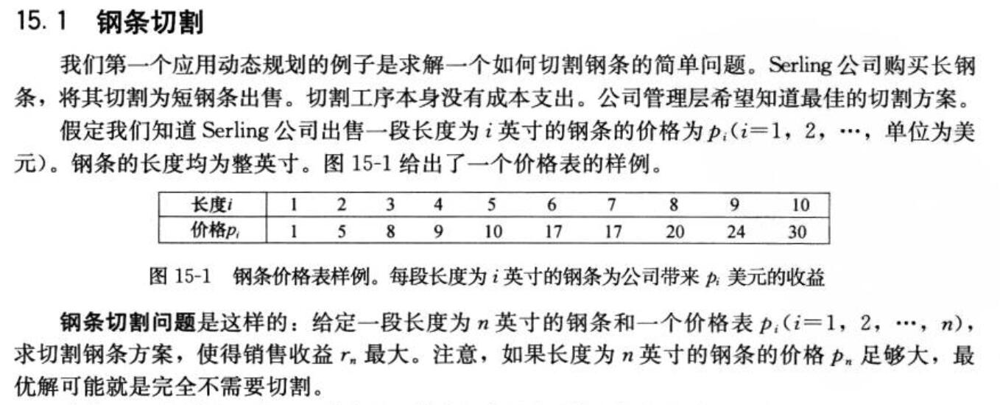
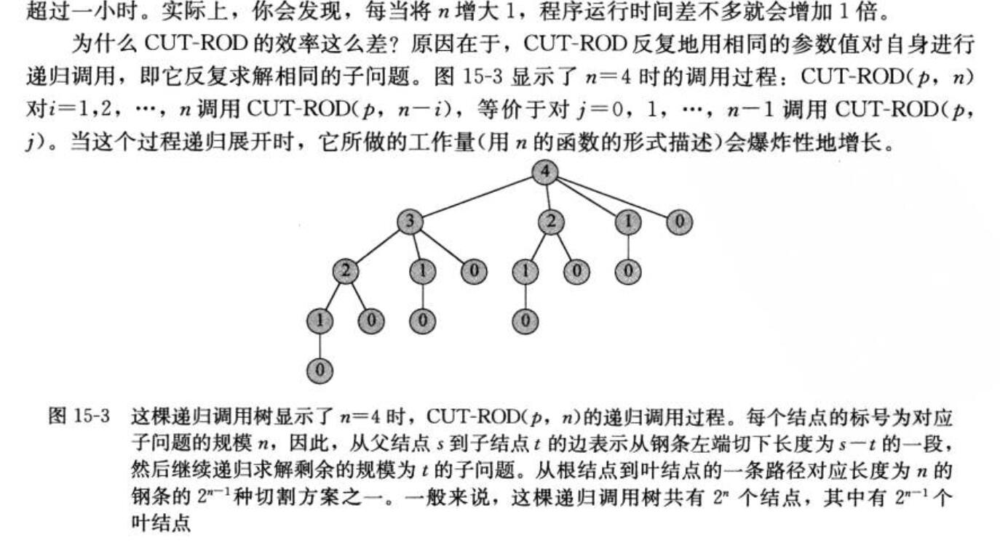
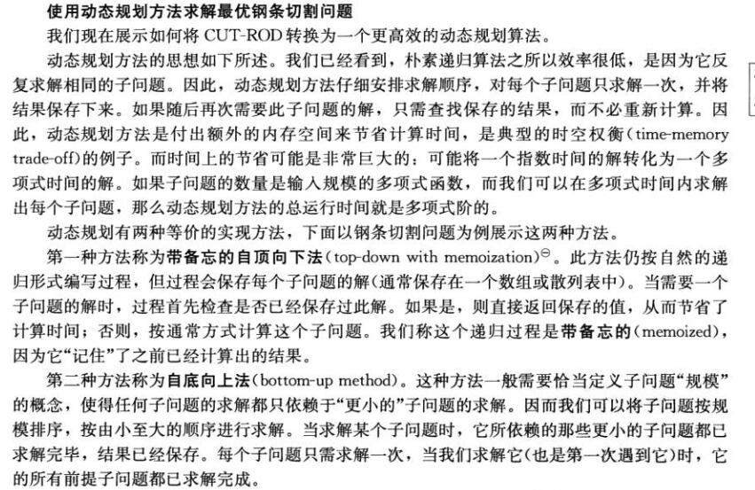

# 动态规划（Dynamic Programming）

## 动态规划算法设计步骤

1. 刻画一个最优解的结构特征；

2. 递归地定义最优解的值；

3. 计算最优解的值，通常使用自底向上的方法；

4. 利用计算出的信息构造一个最优解

   


## 1.钢条切割问题



### 递归求解方法

我们将钢条从左边切割下来长度为$i$的一段，只对右边剩下长度为$n-i$的一段继续进行分割（递归求解）。
$$
r_n=\max_{1\leq i\leq n}(p_i+r_{n-i})
$$

```
CUT-ROD(p,n)
	if n==0
		return 0
	q= -inf
	for i =1 to n
		q= max(q,p[i]+CUT-ROD(p,n-i))
	return q
```



CUT-ROD的运行时间为$n$的指数函数


### 使用动态规划方法求解



 下面给出的是自顶向下CUT-ROD过程的伪代码，加入了备忘机制：

```
MEMOIZED-CUT-ROD（p,n）
let r[o,,n] be a new array
for i = 0 to n
	r[i] = -inf     //将辅助数组初始化为负无穷
return MEMORIZED-CUT-ROD-AUX(p,n.r) //调用辅助过程

MEMORIZED-CUT-ROD-AUX(p,n,r)
if r[n] >= 0		//检查所需值是否已知
	return r[n]		//如果已知，直接返回已知值
if n == 0           //否则，使用通常方法计算
	q = 0
else q = -inf
	for i = 1 to n
		q = max(q,p[i]+MEMORIZED-CUT-ROD-AUX(p,n-i,r))
r[n] = q			//将计算的值q保存到r[n]
return q

```


自底向上版本

```
BOTTOM-UP-CUT-ROD(p,n)
let r[0,,n] be a new array
r[0]=0
for j = 1 to n
	q = -inf
	for i = 1 to j
		q = max(q,p[i]+r[j-i])
	r[j] = q
return r[n]
```


### 扩展动态规划算法

上述算法只给出了最优解（最大收益）的值但没有给出切割方案。

下面给出的是BOTTOM-UP-CUT-ROD(p,n)的扩展版本，它对长度为j的钢条不仅计算最大收益指$r_j$，还保存最优解对应的每一段钢条的切割长度$s$;

```
EXTEND-BOTTOM-UP-CUT-ROD(p,n)
let r[0,,n] be a new array
r[0]=0
for j = 1 to n
	q = -inf
	for i = 1 to j
		if q < p[i]+r[j-i]
			q = q,p[i]+r[j-i]
			s[j] = i		//保存最优切割长度i
	r[j] = q
return r[n]

PRINT-CUT-ROD-SOLUTION(p,n)
(r,s)=EXTEND-BOTTOM-UP-CUT-ROD(p,n)
while n > 0
	print s[n]
	n = n-s[n]
```

