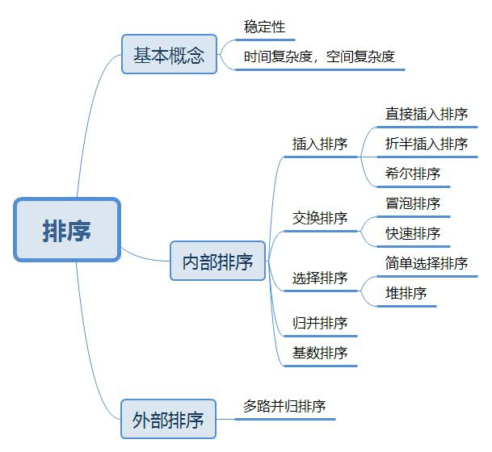
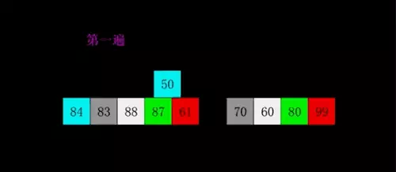
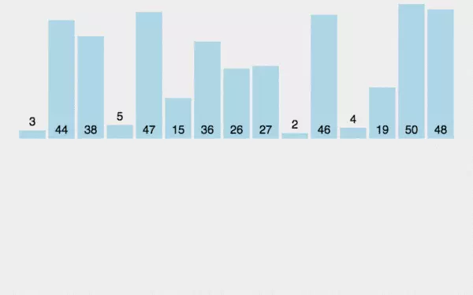
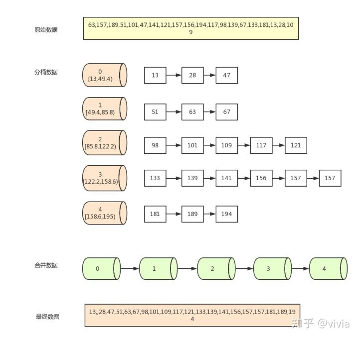

#                                 排序

[TOC]


## 写在前面

​    		在网上有好多大神的，那我还要不要写一遍。哎，大神的是大神的，和你飞某人有神魔关系，自己写一遍是为了自己理解，就当做是学习笔记吧。

参考链接：

https://www.runoob.com/w3cnote/ten-sorting-algorithm.html

https://zhuanlan.zhihu.com/p/42586566

https://www.cnblogs.com/guoyaohua/p/8600214.html

## 知识框架




## 稳定性和时间复杂度比较

**时间复杂度**

平方阶 ($O(n^2)$)                    各类简单排序：直接插入、直接选择和冒泡排序。

线性对数阶 ($O(nlog_2n)$)    快速排序、堆排序和归并排序；

$O(n+§)$，§ 是介于 0 和 1 之间的常数。 希尔排序

线性阶 ($O(n)$)                      基数排序，此外还有桶、箱排序。

**稳定性**

稳定的排序算法：冒泡排序、插入排序、归并排序和基数排序。

不是稳定的排序算法：选择排序、快速排序、希尔排序、堆排序。

## 名词解释

**稳定**：如果a原本在b前面,并且a=b,排序之后a仍然在b前面；

**不稳定**：如果a原本在b前面,并且a=b,排序之后a可在b后面；

**内排序**：所有排序操作都在内存中完成；

**外排序**：由于数据太大，把数据放在磁盘中，而排序通过磁盘和内存的数据传输才能进行；

**时间复杂度**：一个算法执行所耗费的时间；

**空间复杂度**：运行完一个程序所消耗的内存大小

## 比较和非比较的区别

常见的**快速排序、归并排序、堆排序、冒泡排序**等属于**比较排序**。**在排序的最终结果里，元素之间的次序依赖于它们之间的比较。每个数都必须和其他数进行比较，才能确定自己的位置。**
在**冒泡排序**之类的排序中，问题规模为n，又因为需要比较n次，所以平均时间复杂度为O(n²)。在**归并排序、快速排序**之类的排序中，问题规模通过**分治法**消减为logN次，所以时间复杂度平均**O(nlogn)**。
比较排序的优势是，适用于各种规模的数据，也不在乎数据的分布，都能进行排序。可以说，**比较排序适用于一切需要排序的情况。**

**计数排序、基数排序、桶排序**则属于**非比较排序**。非比较排序是通过确定每个元素之前，应该有多少个元素来排序。针对数组arr，计算arr[i]之前有多少个元素，则唯一确定了arr[i]在排序后数组中的位置。
非比较排序只要确定每个元素之前的已有的元素个数即可，所有一次遍历即可解决。算法时间复杂度**O(n)**。
**非比较排序时间复杂度底，但由于非比较排序需要占用空间来确定唯一位置。所以对数据规模和数据分布有一定的要求。**

## 1.直接插入排序（Insertion Sort）

**直接插入排序（Insertion Sort）**简单直观，基本思想是将待排记录按关键字插入到前面已经排好的序列中，对于未排数据，从已经排列的数据从后往前扫描，找到相应的位置插入。所以在从后往前扫描时，需要反复将已经排序的元素逐步后挪。

###     1.1算法描述

一般来说，插入排序都采用in-place在数组上实现。具体算法描述如下：

- 步骤1: 从第一个元素开始，该元素可以认为已经被排序；
- 步骤2: 取出下一个元素，在已经排序的元素序列中从后向前扫描。如果该元素（已排序）大于新元素，将该元素移到下一位置，直到找到已排序的元素小于或者等于新元素的位置，将新元素插入到该位置后；
- 步骤3: 重复步骤2。


###      1.2算法演示


### 1.3代码实现

```c++
void insertion_sort(int arr[],int len){
        for(int i=1;i<len;i++){
                int key=arr[i];
                int j=i-1;
                while((j>=0) && (key<arr[j])){
                        arr[j+1]=arr[j];
                        j--;
                }
                arr[j+1]=key;
        }
}
```

###    1.4算法分析

#### 复杂度

 		**空间上**：只需一个记录的辅助空间

​         **时间上**：排序的基本操作为比较和移动

​        		 **最佳情况** 当待排列的记录按关键字非递减有序排列（正序）时，所需进行关键字之间的比较次数最小为**n-1**  ($\sum_{i=2}^n1$), 记录不需要移动, $O(n)$

​			 	**最差情况** 当当待排列的记录按关键字非递增有序排列（逆序）时，所需进行关键字之间的比较次数最大(n+2)(n-1)/2($\sum_{i=2}^ni$ ), 记录移动次数也变为最大(n+4)(n-1)/2($\sum_{i=2}^n{i+1}$)

​    			**平均情况** 可取上述最大值和最小值的平均值，$O(n^2)$

#### 稳定性

​          由于只需要找到不大于当前数的位置而并不需要交换，因此，直接插入排序是稳定的排序方法

#### 使用场景

​    插入排序由于 $O(n^2)$的复杂度，在数组较大的时候不适用。但是，在数据比较少的时候，是一个不错的选择，一般做为快速排序的扩充。例如，在**STL**的sort算法和**stdlib**的**qsort**算法中，都将插入排序作为快速排序的补充，用于少量元素的排序。又如，在**JDK 7 java.util.Arrays**所用的**sort**方法的实现中，当待排数组长度小于47时，会使用插入排序。

### 1.5优化—— 折半插入排序(Binary Insertion Sort)

由于直接插入排序的基本操作是查找和插入。可以用”折半查找“来实现，因此**折半插入排序**仅减少了关键字之间的比较次数，而记录的移动次数不变，时间复杂度仍为$O(n)$

```
void BInsertSort(int L[],int length){
	//对顺序表L进行折半插入排序
	int low,high,temp,mid;
	for( int i=1;i<=length;++i){
	    temp=L[i];    	//将L.r[i ]暂存到temp
		low=0;  high=i-1;
		while(low<=high){ 	//在r[low...high]中折半查找有序插入的位置 
		     mid=(low+high)/2; //折半 
			if(temp<L[mid])
			   high=mid-1;    //插入点在低半段
			else
			   low=mid+1;    //插入点在高半区 
		}
		for( int j=i-1;j>=high+1;--j)
		   L[j+1]=L[j];//记录后移 
	   L[high+1]=temp;//插入 
    } 
}
```

## 2. 希尔排序(Diminishing Increment Sort)

在希尔排序出现之前，计算机界普遍存在“排序算法不可能突破$O(n^2)$”的观点。希尔排序是第一个突破$O(n^2)$的排序算法，它是简单插入排序的改进版。希尔排序的提出，主要基于以下两点：

1. 插入排序算法在数组基本有序的情况下，可以近似达到O(n)复杂度，效率极高。
2. 但插入排序每次只能将数据移动一位，在数组较大且基本无序的情况下性能会迅速恶化。

### 2.1 算法描述

先将整个待排序的记录序列分割成为若干子序列分别进行直接插入排序，具体算法描述：

- 选择一个增量序列 $t_1，t_2，…，t_k，其中t_i>t_j，t_k=1$；
- 按增量序列个数$k$，对序列进行$ k $趟排序；
- 每趟排序，根据对应的增量$t_i$，将待排序列分割成若干长度为$m$ 的子序列，分别对各子表进行直接插入排序。仅增量因子为$1$ 时，整个序列作为一个表来处理，表长度即为整个序列的长度。

### 2.2算法演示





### 2.3代码实现

希尔增量 n/2 (n/2)/2 ... 1

```c
希尔增量 n/2 (n/2)/2 ... 1
void shell_sort(int arr[], int len) {
    int gap, i, j;
    int temp;
    for (gap = len >> 1; gap > 0; gap >>= 1)
          for (i = gap; i < len; i++) {
               temp = arr[i];
               for (j = i - gap; j >= 0 && arr[j] > temp; j -= gap)
                      arr[j + gap] = arr[j];
               arr[j + gap] = temp;
         }
}
```

​      $O(n^{3/2})$ by Knuth 1, 4, 13, 40, 121...

```c++
template<typename T>
void shell_sort(T array[], int length) {
    int h = 1;
    while (h < length / 3) {
        h = 3 * h + 1;
    }
    while (h >= 1) {
        for (int i = h; i < length; i++) {
            for (int j = i; j >= h && array[j] < array[j - h]; j -= h) {
                std::swap(array[j], array[j - h]);
            }
        }
        h = h / 3;
    }
}
```

### 2.4增量序列

希尔排序的增量数列可以任取，需要的唯一条件是最后一个一定为1（因为要保证按1有序）。但是，不同的数列选取会对算法的性能造成极大的影响。上面的代码演示了两种增量。
切记：增量序列中每两个元素最好不要出现1以外的公因子！（很显然，按4有序的数列再去按2排序意义并不大）。

下面是一些常见的增量序列。

1. Donald Shell增量。折半降低直到1。据研究，使用希尔增量，其时间复杂度还是$O(n^2)$。

2. Hibbard 增量。

     递推公式： 
   $h_1=1,h_i=2∗h_{i−1}+1$

   1,3,7,15,31,63,127,255,511,1023......

    最坏时间复杂度为$ Θ(N^{3/2})$；平均时间复杂度约为 $O(N^{5/4})$。

3. Knuth增量。

   递推公式：

   $h_1=1,h_i=3∗h_{i−1}+1$

   1,4,13,40,121,364,1093,3280......

   最坏时间复杂度为 $O(N^{4/3})O(N^{4/3})$；平均时间复杂度约为 $O(N^{7/6})$

4. Sedgewick增量。

   通项公式： 

   $h_i=max(9∗4^j−9∗2^j+1,4^k−3∗2^k+1)$

   1,5,19,41,109.209,505,929,2161,3905......

### 2.5算法分析

**空间复杂度**：只需一个记录的辅助空间

#### 稳定性

我们都知道插入排序是稳定算法。但是，Shell排序是一个多次插入的过程。在一次插入中我们能确保不移动相同元素的顺序，但在多次的插入中，相同元素完全有可能在不同的插入轮次被移动，最后稳定性被破坏，因此，Shell排序不是一个稳定的算法

#### 适用场景

Shell排序虽然快，但是毕竟是插入排序，其数量级并没有后起之秀--快速排序$O(n log n)$ 。在大量数据面前，Shell排序不是一个好的算法。但是，中小型规模的数据完全可以使用它。

## 3. 冒泡排序(Bubble Sort)

冒泡排序是一种简单的排序算法。它重复地走访过要排序的数列，一次比较两个元素，如果它们的顺序错误就把它们交换过来。每趟排序使得关键字大的记录安置到最后。在冒泡过程中，关键字较小的记录好比水中的气泡逐趟上升，而关键字较大的记录数则好比石块逐趟下沉，每一趟有一块“最大”的石块下沉到底部。

### 3.1算法描述

 首先将第一个记录的关键字和第二个记录的关键字进行比较，如果未逆序则进行交换，以此类推，一直到第n-1和n个记录的关键字进行比较为止。上述过程称为一次冒泡排序，其结果使得关键字最大的记录被安排在最后一个记录的位置上。

然后进行第二趟排序，对前n-1个记录进行同样操作，其结果是关键字次大的记录数被安排在第n-1个位置。

一般的，第i趟排序是从$L.r[1]$到$L.r[n-i+1]$依次比较相邻两个记录的关键字，并在逆序时交换位置，其结果是这$n-i+1$个记录中关键字最大的记录被交换到第$n-i+1$的位置。

整个排序过程需要进行$k(1\leq k<n)$趟排序。显然，判断排序结束的条件是“在一条趟排序过程中没有进行交换记录的操作”。

### 3.2算法演示


### 3.4代码实现

```c++
#include <iostream>
using namespace std;
template<typename T> 
//整数或浮点数皆可使用,若要使用类(class)或结构体(struct)时必须重载大于(>)运算符
void bubble_sort(T arr[], int len) {
        int i, j;
        for (i = 0; i < len - 1; i++)
                for (j = 0; j < len - 1 - i; j++)
                        if (arr[j] > arr[j + 1])
                                swap(arr[j], arr[j + 1]);
}
int main() {
        int arr[] = { 61, 17, 29, 22, 34, 60, 72, 21, 50, 1, 62 };
        int len = (int) sizeof(arr) / sizeof(*arr);
        bubble_sort(arr, len);
        for (int i = 0; i < len; i++)
                cout << arr[i] << ' ';
        cout << endl;
        float arrf[] = { 17.5, 19.1, 0.6, 1.9, 10.5, 12.4, 3.8, 19.7, 1.5, 25.4, 28.6, 4.4, 23.8, 5.4 };
        len = (float) sizeof(arrf) / sizeof(*arrf);
        bubble_sort(arrf, len);
        for (int i = 0; i < len; i++)
                cout << arrf[i] << ' '<<endl;
        return 0;
}
```

### 3.5算法分析

#### 复杂度

在数据完全有序的时候展现出最优时间复杂度，为$O(n)$。其他情况下，几乎总是$O( n^2 )$。因此，算法在数据基本有序的情况下，性能最好

#### 稳定性

在相邻元素相等时，它们并不会交换位置，所以，冒泡排序是稳定排序。

### 3.6算法改进

要使算法在最佳情况下有$O(n)$复杂度，需要做一些改进，增加一个`swap`的标志，当前一轮没有进行交换时，说明数组已经有序，没有必要再进行下一轮的循环了，直接退出。

```java
public static void bubbleSort(int[] arr) {
    int temp = 0;
    boolean swap;
    for (int i = arr.length - 1; i > 0; i--) { // 每次需要排序的长度
        swap=false;
        for (int j = 0; j < i; j++) { // 从第一个元素到第i个元素
            if (arr[j] > arr[j + 1]) {
                temp = arr[j];
                arr[j] = arr[j + 1];
                arr[j + 1] = temp;
                swap=true;
            }
        }//loop j
        if (swap==false){
            break;
        }
    }//loop i
}// method bubbleSort
```


## 4. 快速排序(Quick Sort)

快速排序对于大数据的优秀排序性能和相同复杂度算法中相对简单的实现使它注定得到比其他算法更多的宠爱。

快速排序的最坏运行情况是 O(n²)，比如说顺序数列的快排。但它的平摊期望时间是 O(nlogn)，且 O(nlogn) 记号中隐含的常数因子很小，比复杂度稳定等于 O(nlogn) 的归并排序要小很多。所以，对绝大多数顺序性较弱的随机数列而言，快速排序总是优于归并排序

基本思想是，通过一趟排序将待排记录分割为独立的两部分，其中一部分的记录的关键字均小于另一部分记录的关键字，则可分别对这两部分记录继续排序，以达到整个记录均有序。

### 4.1算法描述

1. 从数列中挑出一个元素，称为"基准"（pivot），
2. 重新排序数列，所有比基准值小的元素摆放在基准前面，所有比基准值大的元素摆在基准后面（相同的数可以到任何一边）。在这个分区结束之后，该基准就处于数列的中间位置。这个称为分区（partition）操作。
3. 递归地（recursively）把小于基准值元素的子数列和大于基准值元素的子数列排序。

### 4.2算法演示


### 4.3代码实现

```c
//严蔚敏《数据结构》标准分割函数
 Paritition1(int A[], int low, int high) {
   int pivot = A[low];          //枢纽记录关键字
   while (low < high) {         //从表的两端交替向中间扫描
     while (low < high && A[high] >= pivot) {
       --high;
     }
     A[low] = A[high];          //将枢纽记录小的记录移到低端
     while (low < high && A[low] <= pivot) {
       ++low;
     }
     A[high] = A[low];          //将枢纽记录大的记录移到高端
   }
   A[low] = pivot;              //枢纽记录到位
   return low;                  //返回枢纽位置
 }

 void QuickSort(int A[], int low, int high) //快排母函数
 {
   if (low < high) {                        //长度大于1
     int pivot = Paritition1(A, low, high); //将A一分为二
     QuickSort(A, low, pivot - 1);          //对低子表递归排序
     QuickSort(A, pivot + 1, high);
   }
 }
```

### 4.4算法分析

#### 复杂度

 **空间上** 

快速排序需要一个栈空间来实现递归。若每趟排序都将记录均匀分割为长度近似的两个子序列，则栈的最大深度为$\lfloor log_2 n\rfloor +1$ (包括最外层参量进栈)，但是，若每趟排序之后，枢纽位置均偏向子序列的一端，则为最坏情况，栈的最大深度为$n$。

**时间上**  $O(nlogn)$

通常，快速排序被认为是，在所有同数量级（$O(nlogn)$）的排序方法中，其平均性能最好。但是如果初始记录按关键字有序或者基本有序时，快速排序将蜕化为冒泡排序，其时间复杂度为$O(n^2)$。为改进之，通常依“**三者取中**”的法则来选取枢纽记录.经验证明，采用三者取中的规则可大大改善快速排序在最坏情况下的性能。然而，即使如此，也不能使快速排序在待排记录序列按关键字有序时达到$O(n)$的时间复杂度。

#### 稳定性

快速排序并不是稳定的。这是因为我们无法保证相等的数据按顺序被扫描到和按顺序存放。

### 4.5 算法改进

STL库将快速排序做了改进。没有使用两边递归，而是一边递归，另一边循环。并且使用了“三者取中”的规则。

```c++
template<typename _RandomAccessIterator, typename _Size, typename _Compare>
    void  __introsort_loop(_RandomAccessIterator __first,
		     				_RandomAccessIterator __last,
		    				 _Size __depth_limit, _Compare __comp)
{
      while (__last - __first > int(_S_threshold))
      {
	  /*堆排序部分,当快速排序层数过大时，改用堆排序
	  if (__depth_limit == 0)
	    {
	      std::__partial_sort(__first, __last, __last, __comp);
	      return;
	    }
	  --__depth_limit;
	  */
	  //将集合分为两部分
	  _RandomAccessIterator __cut =
	    std::__unguarded_partition_pivot(__first, __last, __comp);
	  //后一半递归
	  std::__introsort_loop(__cut, __last, __depth_limit, __comp);
	  //前一半继续排序
	  __last = __cut;
	}
}
    //
    template<typename _RandomAccessIterator, typename _Compare>
    inline _RandomAccessIterator
    __unguarded_partition_pivot(_RandomAccessIterator __first,
				_RandomAccessIterator __last, _Compare __comp)
{ //取三点中值
      _RandomAccessIterator __mid = __first + (__last - __first) / 2;
      std::__move_median_to_first(__first, __first + 1, __mid, __last - 1,
				  __comp);
      return std::__unguarded_partition(__first + 1, __last, __first, __comp);
}
    //快速排序的主体部分
    template<typename _RandomAccessIterator, typename _Compare>
    _RandomAccessIterator
    __unguarded_partition(_RandomAccessIterator __first,
			  _RandomAccessIterator __last,
			  _RandomAccessIterator __pivot, _Compare __comp)
{
      while (true)
	{
	  while (__comp(__first, __pivot))
	    ++__first;
	  --__last;
	  while (__comp(__pivot, __last))
	    --__last;
	  if (!(__first < __last))
	    return __first;
	  std::iter_swap(__first, __last);
	  ++__first;
	}
}
```

## 5. 简单选择排序(Simple Selection Sort)

冒泡算法，每次比较如果发现较小的元素在后面，就交换两个相邻的元素。而选择排序算法的改进在于：先并不急于调换位置，先从A[1]开始逐个检查，看哪个数最小就记下该数所在的位置P，等一躺扫描完毕，再把A[P]和A[1]对调，这时A[1]到A[10]中最小的数据就换到了最前面的位置。所以，选择排序每扫描一遍数组，只需要一次真正的交换，而冒泡可能需要多次。比较的次数是一样的。

### 5.1算法描述

1. 在未排序序列中找到最小（大）元素，存放到排序序列的起始位置
2. 从剩余未排序元素中继续寻找最小（大）元素，然后放到已排序序列的末尾。
3. 重复第二步，直到所有元素均排序完毕。

### 5.2算法演示


### 5.3代码实现

```c++
template<typename T> 
//整數或浮點數皆可使用，若要使用物件（class）時必須設定大於（>）的運算子功能
void selection_sort(std::vector<T>& arr) {
        for (int i = 0; i < arr.size() - 1; i++) {
                int min = i;
                for (int j = i + 1; j < arr.size(); j++)
                        if (arr[j] < arr[min])
                                min = j;
                std::swap(arr[i], arr[min]);
        }
}
```

### 5.4算法分析

#### 稳定性

用数组实现的选择排序是不稳定的，用链表实现的选择排序是稳定的。
不过，一般提到排序算法时，大家往往会默认是数组实现，所以选择排序是不稳定的

#### 复杂度

所需要的进行记录移动的操作次数最少为“0”，最大为$3(n-1)$，然而，不论记录的初始排列如何，所需要的进行关键字间的比较次数相同均为$n(n-1)/2$。因此总的时间复杂度为$O(n^2)$

#### 使用场景

选择排序实现也比较简单，并且由于在各种情况下复杂度波动小，因此一般是优于冒泡排序的。在所有的完全交换排序中，选择排序也是比较不错的一种算法。但是，由于固有的$O(n^2)$复杂度，选择排序在海量数据面前显得力不从心。因此，它适用于简单数据排序。

## 6. 堆排序(Heap Sort)

堆排序(Heap Sort)是指利用堆积树（堆）这种数据结构所设计的一种排序算法，它是选择排序的一种。可以利用数组的特点快速定位指定索引的元素。堆排序就是把最大堆堆顶的最大数取出，将剩余的堆继续调整为最大堆，再次将堆顶的最大数取出，这个过程持续到剩余数只有一个时结束。

### **6.1堆的概念**

堆是一种特殊的完全二叉树（complete binary tree）。完全二叉树的一个“优秀”的性质是，除了最底层之外，每一层都是满的，这使得堆可以利用数组来表示（普通的一般的二叉树通常用链表作为基本容器表示），每一个结点对应数组中的一个元素。

如下图，是一个堆和数组的相互关系：


对于给定的某个结点的下标 i，可以很容易的计算出这个结点的父结点、孩子结点的下标：

- Parent(i) = floor(i/2)，i 的父节点下标
- Left(i) = 2i，i 的左子节点下标
- Right(i) = 2i + 1，i 的右子节点下标

二叉堆一般分为两种：最大堆和最小堆。
**最大堆：**
最大堆中的最大元素值出现在根结点（堆顶）
堆中每个父节点的元素值都大于等于其孩子结点（如果存在）


**最小堆：**
最小堆中的最小元素值出现在根结点（堆顶）
堆中每个父节点的元素值都小于等于其孩子结点（如果存在）


### **堆排序原理**

堆排序就是把最大堆堆顶的最大数取出，将剩余的堆继续调整为最大堆，再次将堆顶的最大数取出，这个过程持续到剩余数只有一个时结束。在堆中定义以下几种操作：

- 最大堆调整（Max-Heapify）：将堆的末端子节点作调整，使得子节点永远小于父节点
- 创建最大堆（Build-Max-Heap）：将堆所有数据重新排序，使其成为最大堆
- 堆排序（Heap-Sort）：移除位在第一个数据的根节点，并做最大堆调整的递归运算 继续进行下面的讨论前，需要注意的一个问题是：数组都是 Zero-Based，这就意味着我们的堆数据结构模型要发生改变


相应的，几个计算公式也要作出相应调整：

- Parent(i) = floor((i-1)/2)，i 的父节点下标
- Left(i) = 2i + 1，i 的左子节点下标
- Right(i) = 2(i + 1)，i 的右子节点下标

### **堆的建立和维护**

堆可以支持多种操作，但现在我们关心的只有两个问题：

1. 给定一个无序数组，如何建立为堆？
2. 删除堆顶元素后，如何调整数组成为新堆？

先看第二个问题。假定我们已经有一个现成的大根堆。现在我们删除了根元素，但并没有移动别的元素。想想发生了什么：根元素空了，但其它元素还保持着堆的性质。我们可以把**最后一个元素**（代号A）移动到根元素的位置。如果不是特殊情况，则堆的性质被破坏。但这仅仅是由于A小于其某个子元素。于是，我们可以把A和这个子元素调换位置。如果A大于其所有子元素，则堆调整好了；否则，重复上述过程，A元素在树形结构中不断“下沉”，直到合适的位置，数组重新恢复堆的性质。上述过程一般称为“筛选”，方向显然是自上而下。

> 删除后的调整，是把最后一个元素放到堆顶，自上而下比较

删除一个元素是如此，插入一个新元素也是如此。不同的是，我们把新元素放在**末尾**，然后和其父节点做比较，即自下而上筛选。

> 插入是把新元素放在末尾，自下而上比较

那么，第一个问题怎么解决呢？

常规方法是从第一个非叶子结点向下筛选，直到根元素筛选完毕。这个方法叫“筛选法”，需要循环筛选n/2个元素。

但我们还可以借鉴“插入排序”的思路。我们可以视第一个元素为一个堆，然后不断向其中添加新元素。这个方法叫做“插入法”，需要循环插入(n-1)个元素。

由于筛选法和插入法的方式不同，所以，相同的数据，它们建立的堆一般不同。大致了解堆之后，堆排序就是水到渠成的事情了。


### 6.2 算法演示


### 6.3算法描述

建立最大堆，倒着输出，在最后一个位置输出最大值，次末位置输出次大值……由于每次输出的最大元素会腾出第一个空间，因此，我们恰好可以放置这样的元素而不需要额外空间。

- 将初始待排序关键字序列(R1,R2….Rn)构建成大顶堆，此堆为初始的无序区；
- 将堆顶元素R[1]与最后一个元素R[n]交换，此时得到新的无序区(R1,R2,……Rn-1)和新的有序区(Rn),且满足R[1,2…n-1]<=R[n]；
- 由于交换后新的堆顶R[1]可能违反堆的性质，因此需要对当前无序区(R1,R2,……Rn-1)调整为新堆，然后再次将R[1]与无序区最后一个元素交换，得到新的无序区(R1,R2….Rn-2)和新的有序区(Rn-1,Rn)。不断重复此过程直到有序区的元素个数为n-1，则整个排序过程完成。

### 6.3算法实现

```c++
#include <iostream>
#include <algorithm>
using namespace std;

void max_heapify(int arr[], int start, int end) {
    // 建立父節點指標和子節點指標
    int dad = start;
    int son = dad * 2 + 1;
    while (son <= end) { // 若子節點指標在範圍內才做比較
        if (son + 1 <= end && arr[son] < arr[son + 1]) // 先比較兩個子節點大小，選擇最大的
            son++;
        if (arr[dad] > arr[son]) // 如果父節點大於子節點代表調整完畢，直接跳出函數
            return;
        else { // 否則交換父子內容再繼續子節點和孫節點比較
            swap(arr[dad], arr[son]);
            dad = son;
            son = dad * 2 + 1;
        }
    }
}

void heap_sort(int arr[], int len) {
    // 初始化，i從最後一個父節點開始調整
    for (int i = len / 2 - 1; i >= 0; i--)
        max_heapify(arr, i, len - 1);
    // 先將第一個元素和已经排好的元素前一位做交換，再從新調整(刚调整的元素之前的元素)，直到排序完畢
    for (int i = len - 1; i > 0; i--) {
        swap(arr[0], arr[i]);
        max_heapify(arr, 0, i - 1);
    }
}

int main() {
    int arr[] = {60,91,13,19,30,10,35,81,77,20,22,96,31,46,65};
    int len = (int) sizeof(arr) / sizeof(*arr);
    heap_sort(arr, len);
    for (int i = 0; i < len; i++)
        cout << arr[i] << ' ';
    cout << endl;
    return 0;
}
```

### 6.4算法分析

#### 稳定性

堆排序存在大量的筛选和移动过程，属于不稳定的排序算法。

#### 复杂度

**空间上**

仅需一个记录大小供交换用的辅助空间

**时间上** $O(nlogn)$

堆排序在最坏情况下，其时间复杂度也为$O(nlogn)$。

其运行时间主要耗费在建最初堆和调整新堆时进行的反复“筛选”上。对深度为$k$的堆，筛选算法中进行关键字的比较次数至多为$2(k-1)$次，则在建含$n$个元素、深度为$h$的堆时，总共进行的关键字比较次数不会超过$4n$。又，$n$个结点的完全二叉树的深度为$\lfloor log_2 n \rfloor +1$，则进行重建新堆时调用Heap Adjust 过程$n-1$次，总共进行的比较次数不超过$2n(\lfloor log_2 n \rfloor) $。

#### 使用场景

堆排序在建立堆和调整堆的过程中会产生比较大的开销，在元素少的时候并不适用。但是，在元素比较多的情况下，还是不错的一个选择。尤其是在解决诸如“前n大的数”一类问题时，几乎是首选算法。

## 7. 归并排序(Merging Sort)

归并排序是建立在归并操作上的一种有效的排序算法。该算法是采用分治法的一个非常典型的应用。将已有序的子序列合并，得到完全有序的序列；即先使每个子序列有序，再使子序列段间有序。若将两个有序表合并成一个有序表，称为2-路归并。

### 7.1算法描述

两种方法

- 递归法（Top-down）

1. 申请空间，使其大小为两个已经排序序列之和，该空间用来存放合并后的序列
2. 设定两个指针，最初位置分别为两个已经排序序列的起始位置
3. 比较两个指针所指向的元素，选择相对小的元素放入到合并空间，并移动指针到下一位置
4. 重复步骤3直到某一指针到达序列尾
5. 将另一序列剩下的所有元素直接复制到合并序列尾

- 迭代法（Bottom-up）

原理如下（假设序列共有n个元素）：

1. 将序列每相邻两个数字进行归并操作，形成ceil(n/2)个序列，排序后每个序列包含两/一个元素
2. 若此时序列数不是1个则将上述序列再次归并，形成ceil(n/4)个序列，每个序列包含四/三个元素
3. 重复步骤2，直到所有元素排序完毕，即序列数为1

### 7.2算法演示




### 7.3算法实现

​	C++

**递归版**：

```c++
void MergeSort(vector<int> &Array, int front, int end) {
    if (front >= end)
        return;
    int mid = (front + end) / 2; //将Array平分
    MergeSort(Array, front, mid);//递归地将Array[front,mid]归并为有序
    MergeSort(Array, mid + 1, end);//递归地将Array[mid+1,end]归并为有序
    Merge(Array, front, mid, end);//将Array[front,mid]，Array[mid+1,end]合并
}
void Merge(vector<int> &Array, int front, int mid, int end) {
    // preconditions:
    // Array[front...mid] is sorted
    // Array[mid+1 ... end] is sorted
    // Copy Array[front ... mid] to LeftSubArray
    // Copy Array[mid+1 ... end] to RightSubArray
    vector<int> LeftSubArray(Array.begin() + front, Array.begin() + mid + 1);
    vector<int> RightSubArray(Array.begin() + mid + 1, Array.begin() + end + 1);
    int idxLeft = 0, idxRight = 0;
    LeftSubArray.insert(LeftSubArray.end(), numeric_limits<int>::max());
    RightSubArray.insert(RightSubArray.end(), numeric_limits<int>::max());
    // Pick min of LeftSubArray[idxLeft] and RightSubArray[idxRight], and put into Array[i]
    for (int i = front; i <= end; i++) {
        if (LeftSubArray[idxLeft] < RightSubArray[idxRight]) {
            Array[i] = LeftSubArray[idxLeft];
            idxLeft++;
        } else {
            Array[i] = RightSubArray[idxRight];
            idxRight++;
        }
    }
}
```

**迭代版：**

```c++
template<typename T> 
// 整數或浮點數皆可使用,若要使用物件(class)時必須設定"小於"(<)的運算子功能
void merge_sort(T arr[], int len) {
  T *a = arr;
  T *b = new T[len];
  for (int seg = 1; seg < len; seg += seg) {//控制seg迭代来实现
      for (int start = 0; start < len; start += seg + seg) {
           int low = start, mid = min(start + seg, len), high = min(start + seg + seg, len);
           int k = low;
           int start1 = low, end1 = mid;
           int start2 = mid, end2 = high;
           while (start1 < end1 && start2 < end2)
               b[k++] = a[start1] < a[start2] ? a[start1++] : a[start2++];
           while (start1 < end1)
               b[k++] = a[start1++];
           while (start2 < end2)
               b[k++] = a[start2++];
      }
      T *temp = a;
      a = b;
      b = temp;
  }
  if (a != arr) {
      for (int i = 0; i < len; i++)
           b[i] = a[i];
      b = a;
   }
   delete[] b;
}
```


### 7.4算法分析

#### 稳定性

因为我们在遇到相等的数据的时候必然是按顺序“抄写”到辅助数组上的，所以，归并排序同样是稳定算法

#### 复杂度

**空间上**

空间复杂度O(n)，实现归并排序需要和记录等数量的辅助空间。

**时间上**

时间复杂度$O(nlogn)$

## 8. 基数排序(Radix Sorting)

基数排序是一种非比较型整数排序算法，其原理是将整数按位数切割成不同的数字，然后按每个位数分别比较。由于整数也可以表达字符串（比如名字或日期）和特定格式的浮点数，所以基数排序也不是只能使用于整数。

### 8.1算法描述

- 取得数组中的最大数，并取得位数；
- arr为原始数组，从最低位开始取每个位组成radix数组；
- 对radix进行计数排序（利用计数排序适用于小范围数的特点）；

### 8.2算法演示


### 8.3代码实现

```c++
int maxbit(int data[], int n) //辅助函数，求数据的最大位数
{
    int maxData = data[0];              ///< 最大数
    /// 先求出最大数，再求其位数，这样有原先依次每个数判断其位数，稍微优化点。
    for (int i = 1; i < n; ++i)
    {
        if (maxData < data[i])
            maxData = data[i];
    }
    int d = 1;
    int p = 10;
    while (maxData >= p)
    {
        //p *= 10; // Maybe overflow
        maxData /= 10;
        ++d;
    }
    return d;
/*    int d = 1; //保存最大的位数
    int p = 10;
    for(int i = 0; i < n; ++i)
    {
        while(data[i] >= p)
        {
            p *= 10;
            ++d;
        }
    }
    return d;*/
}
void radixsort(int data[], int n) //基数排序
{
    int d = maxbit(data, n);
    int *tmp = new int[n];
    int *count = new int[10]; //计数器
    int i, j, k;
    int radix = 1;
    for(i = 1; i <= d; i++) //进行d次排序
    {
        for(j = 0; j < 10; j++)
            count[j] = 0; //每次分配前清空计数器
        for(j = 0; j < n; j++)
        {
            k = (data[j] / radix) % 10; //统计每个桶中的记录数
            count[k]++;
        }
        for(j = 1; j < 10; j++)
            count[j] = count[j - 1] + count[j]; //将tmp中的位置依次分配给每个桶
        for(j = n - 1; j >= 0; j--) //将所有桶中记录依次收集到tmp中
        {
            k = (data[j] / radix) % 10;
            tmp[count[k] - 1] = data[j];
            count[k]--;
        }
        for(j = 0; j < n; j++) //将临时数组的内容复制到data中
            data[j] = tmp[j];
        radix = radix * 10;
    }
    delete []tmp;
    delete []count;
}
```

### 8.4算法分析

#### 稳定性

基数排序是按照低位先排序，然后收集；再按照高位排序，然后再收集；依次类推，直到最高位。先按低优先级排序，再按高优先级排序。最后的次序就是高优先级高的在前，高优先级相同的低优先级高的在前。基数排序基于分别排序，分别收集，所以是稳定的。

#### 复杂度

## 9计数排序(Counting Sort)

计数排序不是基于比较的排序算法，其核心在于将输入的数据值转化为键存储在额外开辟的数组空间中。 作为一种线性时间复杂度的排序，计数排序要求输入的数据必须是有确定范围的整数。

计数排序的算法的原理，它不需要去跟其他元素比来比去，而是一开始就知道自己的位置，所以直接归位。在计数的该元素出现的词频数组里面，出现一次，就直接加一次即可，如果没有出现改位置就是0。最后该位置的词频，就是代表其在原始数组里面出现的次数。由于词频数组的index是从0开始，所以最后直接遍历输出这个数组里面的每一个大于0的元素值即可。

### 9.1算法描述

1. 找出待排序的数组中最大和最小的元素；
2. 统计数组中每个值为i的元素出现的次数，存入数组C的第i项；
3. 对所有的计数累加（从C中的第一个元素开始，每一项和前一项相加）；
4. 反向填充目标数组：将每个元素i放在新数组的第C(i)项，每放一个元素就将C(i)减去1

### 9.2算法演示


### 9.4代码实现

```java
public class CountingSort implements IArraySort {

    @Override
    public int[] sort(int[] sourceArray) throws Exception {
        // 对 arr 进行拷贝，不改变参数内容
        int[] arr = Arrays.copyOf(sourceArray, sourceArray.length);

        int maxValue = getMaxValue(arr);

        return countingSort(arr, maxValue);
    }

    private int[] countingSort(int[] arr, int maxValue) {
        int bucketLen = maxValue + 1;
        int[] bucket = new int[bucketLen];

        for (int value : arr) {
            bucket[value]++;
        }

        int sortedIndex = 0;
        for (int j = 0; j < bucketLen; j++) {
            while (bucket[j] > 0) {
                arr[sortedIndex++] = j;
                bucket[j]--;
            }
        }
        return arr;
    }

    private int getMaxValue(int[] arr) {
        int maxValue = arr[0];
        for (int value : arr) {
            if (maxValue < value) {
                maxValue = value;
            }
        }
        return maxValue;
    }

}
```

### 9.5算法分析

####          稳定性

####          复杂度

 当输入的元素是n 个0到k之间的整数时，它的运行时间是 O(n + k)。计数排序不是比较排序，排序的速度快于任何比较排序算法。由于用来计数的数组C的长度取决于待排序数组中数据的范围（等于待排序数组的最大值与最小值的差加上1），这使得计数排序对于数据范围很大的数组，需要大量时间和内存。

**空间上**

$O(n)$

#### 		适用场景

排序目标要能够映射到整数域，其最大值最小值应当容易辨别。另外，计数排序需要占用大量空间，它比较适用于数据比较集中的情况。

计数排序在特定的情况下，排序效率极高，但是如果排序的计数空间范围过大，而实际元素个数非常小的情况，效率就会非常差，比如，我只有3个元素，3，1，500000，这样的情况其实是不适合用计数排序的

## 10桶排序(Bucket Sort)

桶排序是计数排序的升级版。它利用了函数的映射关系，高效与否的关键就在于这个映射函数的确定。为了使桶排序更加高效，我们需要做到这两点：

1. 在额外空间充足的情况下，尽量增大桶的数量
2. 使用的映射函数能够将输入的 N 个数据均匀的分配到 K 个桶中

同时，对于桶中元素的排序，选择何种比较排序算法对于性能的影响至关重要

### 10.1算法描述

1. 找出待排序数组中的最大值max、最小值min。设置桶中放置的数值。
2. 我们使用 动态数组ArrayList 作为桶，桶里放的元素也用 ArrayList 存储。桶的数量为(max-min)/arr.length+1
3. 遍历数组 arr，计算每个元素 arr[i] 放的桶
4. 每个桶各自排序
5. 遍历桶数组，把排序好的元素放进输出数组

### 10.2算法演示



### 10.3 代码实现

```java
public class BucketSort implements IArraySort {

    private static final InsertSort insertSort = new InsertSort();

    @Override
    public int[] sort(int[] sourceArray) throws Exception {
        // 对 arr 进行拷贝，不改变参数内容
        int[] arr = Arrays.copyOf(sourceArray, sourceArray.length);

        return bucketSort(arr, 5);
    }

    private int[] bucketSort(int[] arr, int bucketSize) throws Exception {
        if (arr.length == 0) {
            return arr;
        }

        int minValue = arr[0];
        int maxValue = arr[0];
        for (int value : arr) {
            if (value < minValue) {
                minValue = value;
            } else if (value > maxValue) {
                maxValue = value;
            }
        }

        int bucketCount = (int) Math.floor((maxValue - minValue) / bucketSize) + 1;
        int[][] buckets = new int[bucketCount][0];

        // 利用映射函数将数据分配到各个桶中
        for (int i = 0; i < arr.length; i++) {
            int index = (int) Math.floor((arr[i] - minValue) / bucketSize);
            buckets[index] = arrAppend(buckets[index], arr[i]);
        }

        int arrIndex = 0;
        for (int[] bucket : buckets) {
            if (bucket.length <= 0) {
                continue;
            }
            // 对每个桶进行排序，这里使用了插入排序
            bucket = insertSort.sort(bucket);
            for (int value : bucket) {
                arr[arrIndex++] = value;
            }
        }

        return arr;
    }

    /**
     * 自动扩容，并保存数据
     *
     * @param arr
     * @param value
     */
    private int[] arrAppend(int[] arr, int value) {
        arr = Arrays.copyOf(arr, arr.length + 1);
        arr[arr.length - 1] = value;
        return arr;
    }

}
```

### 10.4 算法分析

#### 复杂度

 需要k个桶，并且这些桶中放了n个元素，空间复杂度为$O(n+k)$

#### 适用场景

显然，当输入的数据可以均匀的分配到每一个桶中时，速度最快。当输入的数据被分配到了同一个桶中时，速度最慢。

### **10.5 基数排序 vs 计数排序 vs 桶排序**

这三种排序算法都利用了桶的概念，但对桶的使用方法上有明显差异：

- 基数排序：根据键值的每位数字来分配桶；
- 计数排序：每个桶只存储单一键值；
- 桶排序：每个桶存储一定范围的数值；