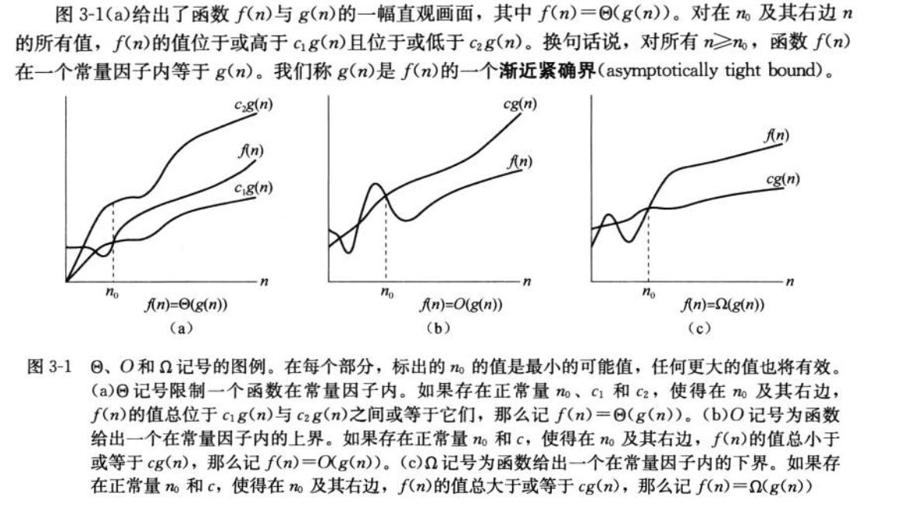

# 渐进记号 与常用函数

## $\Theta$记号

$\Theta(g(n))=\{f(n):存在正常数c_1,c_2,和n_0,使得对所有n \geq n_0,有0\leq c_1g(n) \leq f(n) \leq c_2 g(n) \}$

我们称$g(n)$是$f(n)$的一个**渐进紧确界**。

$\Theta(g(n))$的定义要求每个成员$f(n) \in \Theta(g(n))$均**渐进非负**，即当$n$足够大时，$f(n)$非负。

$\Theta$记号渐近地给出一个函数的上界和下界。

## $O$记号

当只有一个**渐近上界**时，使用$O$记号。

$O(g(n))=\{f(n):存在正常数c和n_0,使得对所有n \geq n_0,有0 \leq f(n) \leq c g(n) \}$

注意，$f(n)=\Theta(g(n))$蕴含着$f(n)=O(g(n))$。按着集合论的写法，我们有$\Theta(g(n))  \subseteq O(g(n))  $。

## $\Omega$记号

当只有一个**渐近下界**时，使用$\Omega$记号。

$\Omega(g(n))=\{f(n):存在正常数c和n_0,使得对所有n \geq n_0,有0  \leq c g(n)\leq f(n) \}$

## $o$记号

我们使用$o$记号来表示一个非渐进紧确的上界。

$o(g(n))=\{f(n):对任意正常量c>0,存在常数n_0>0,使得对所有n \geq n_0,有0 \leq f(n) < c g(n) \}$

当$n$趋近于无穷时，函数$f(n)$相对于$g(n)$来说变得微不足道了。

$\lim\limits_{x\rightarrow\infty} \frac{f(n)}{g(n)}=0  $

## $w$记号

我们使用$o$记号来表示一个非渐进紧确的下界。

$w(g(n))=\{f(n):对任意正常量c>0,存在常数n_0>0,使得对所有n \geq n_0,有0  \leq c g(n) < f(n)\}$

$\lim\limits_{x\rightarrow\infty} \frac{f(n)}{g(n)}= \infty  $

#### *定理3.1

**对任意两个函数$f(n)$和$g(n)$，我们有$f(n)=\Theta(g(n))$，当且仅当$f(n)=O(g(n))$且$f(n)=\Omega(g(n))$。**

#### *定理

**一个算法运行时间为$\Theta(g(n))$当且仅当其最坏运行时间为$O(g(n))$，且其最爱后运行时间为$\Omega(g(n))$。**

#### *定理

**$o(g(n)) \bigcap w(g(n))$为空集。**

## 指数运算

对于所有实数$a>0,m,n$，我们有以下恒等式
$$
\begin{aligned}
		a^0&=1		\\
		a^1&=a		\\
	a^(-1)&=1/a		\\
	(a^m)^n&=a^{mn}=(a^n)^m \\
	a^ma^n&=a^{m+n}
\end{aligned}	\\
对于所有n和a\geq 1,函数a^n关于n单调递增。\\
$$
我们假定$0^0=1$

**多项式与指数的增长率比较**
$$
\begin{aligned}
对所有使得a>1的实常量a和b,有 \\
&\lim_{n\rightarrow \infty} \frac{n^b}{a^n}=0 \\
因此可得 \\
&n^b=o(a^n)
\end{aligned}
$$
**自然对数$e$**
$$
对于所有实数x,我们有 \\
e^x=1+x+\frac{x^2}{2!}+\frac{x^3}{3!}+\cdots=\sum^{\infty}_{i=0}\frac{x^i}{i!}
$$

$$
对所有实数x，我们有不等式 \\
e^x\geq 1+x ,只有x=0时等号成立 \\
当 |x|\leq 1时，有近似估计 \\
1+x+x^2 \geq e^x \geq1+x 
$$

$$
对所有x，我们有： \\
\lim_{n\rightarrow \infty} (1+\frac{x}{n})^n=e^x
$$

## 对数运算

我们将使用以下记号：

 $lgn= log_2n   \tag{以2为底的对数} $

​	$ lnn\tag{自然对数} \\$

​	$ lg^kn=(lgn)^k\tag{取幂} \\$

​	$ lglgn=lg(lgn)\tag{复合} \\$

对所有实数$a>0,b>0.c>0和m,n$，有
$$
\begin{aligned}
		a&=b^{log_ba}		\\
		log_c(ab)&=log_ca+log_cb		\\
	log_ba^n&=nlog_ba		\\
	log_ba&=\frac{log_ca}{log_cb} \\
	log_b(1/a)&=-log_ba \\
	log_ba&=\frac{1}{log_ab}\\
	a^{log_bc}&=c^{log_ba}
\end{aligned}	\\
其中，在上面的每个等式中，对数的底不为1\\
$$

## 阶乘

记号$n!$（读作$n$的阶乘）定义为对整数$n\geq 0$，有
$$
n!= \{ \begin{aligned}
		&1   &若n=0 \\
		&n*(n-1)	&若n>0
\end{aligned} \\
n!=1*2*3*\cdots n
$$
**斯特林(Stirling)近似公式**给出了一个更精确的上下界
$$
n!=\sqrt{2\pi n}(\frac{n}{e})^n(1+\Theta(\frac{1}{n}))
$$
其中$e$是自然对数的底

$$
\begin{aligned}
n!&= o(n^n) \\
n!&= w(2^n)	\\
lg(n!)&=\Theta(nlgn)
\end{aligned}
$$

## 多重函数

## 多重对数函数